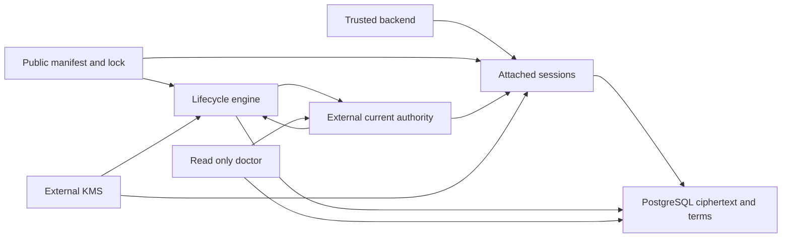

# Cryptalis architecture

Status: DESIGNED. Runtime implementation and production verification are incomplete.
The [status](../status.md) owns current evidence. The [decision ledger](../decisions.md) owns choices and rejected alternatives.

Cryptalis is a manifest-driven application data-protection layer for existing SQLAlchemy backends.
After finalized protection, admitted ordinary writes store selected payloads as ciphertext and support declared equality queries.
Approved lifecycle steps can retain/create plaintext copies. Lifecycle transitions and removal require their verification gates.
The application process is trusted and receives ordinary Python plaintext. Protection is conditional on the [security boundary](../security.md).

## Documentation ownership

| Owner | Read for |
|---|---|
| [README](../../README.md) | Product, adoption example, actual executable entry points |
| This document | Boundaries, components, integration, manifest, storage, CLI and dependency direction |
| [Security](../security.md) | Threat model, crypto, key authority, search leakage and failure contract |
| [Lifecycle](../lifecycle.md) | Migration, rollback, rotation, restore, revocation/destruction, deprotect and removal |
| [Compatibility](../compatibility.md) | Exact intended stack, query/type/path semantics and performance evidence |
| [Build guide](../build-guide.md) | Dependency order, adversarial acceptance and definitions of done |
| [Status](../status.md) | Designed versus implemented versus verified properties |
| [Decisions](../decisions.md) | Alternatives, reasons, confidence and named production blockers |
| [Prior art](../prior-art.md) | Competitor comparisons and external evidence navigation |
| [Engineering playbook](../../ENGINEERING_PLAYBOOK.md) | Manual learning, testing, review and release policy |
| [Research traceability](../research/reset-traceability.md) | Old requirement dispositions at the source commit |

Research records are evidence inputs. They do not define a second architecture.
Formats use internal versions. Product architecture has no generation roadmap.
`SUPPORTED` means included in the final design. Production support also requires a released, verified compatibility cell.
`UNSUPPORTED BY DESIGN` excludes a capability. `INTERNAL ONLY` hides mechanisms from ordinary business code.

## System boundary and data flow



The adapter owns application-to-storage transformation. PostgreSQL never receives payload keys through this interface.
The lifecycle engine owns reconciliation, not ordinary requests. It uses one verified protocol for all changes.
Doctor observes configuration and current facts. A finding never authorizes policy, key destruction, or migration.
The external store owns active policy and irreversible denial, separately from application database restore.
KMS owns root custody. It does not authorize business access. Host authentication and authorization issue trusted grants.

## Integration

Attachment owns a dedicated registry/engine and runs before model instances, sessions, query caches or workers exist.
It validates the entire mapping, rebuilds physical mappings through public registry APIs and installs generated logical descriptors.
Application hybrids/column properties involving protected values, inheritance, composites, custom processors, mapper callbacks
that read protected values and ambiguous relationships reject before effects. The generated adapter descriptor is not support
for arbitrary host hybrids. Required model/bootstrap refactoring is part of adoption.

The designed API (currently unimplemented) is:

```python
sessions = attach(registry=Base.registry, engine=engine,
                  manifest="cryptalis.json", deployment="production")
with sessions(identity=host_verified_grant) as session:
    user.email = "alice@example.com"
    session.add(user)
    session.commit()
    found = session.scalar(select(User).where(User.email == email))
```

There are no public encrypt/decrypt, raw-key or term calls. One immutable host-authenticated grant supplies issuer/audience,
tenant, permitted actions/resources, subject membership and expiry. Host authentication/business authorization remain trusted.
One task owns one session/tenant. Ambient IDs, pooled state and web principals never confer lifecycle privilege.
Record identities exist before encryption. Server-generated protected-row identities require host changes or rejection.

### ORM state and publication

Public `registry.dispose`, `map_imperatively`, `add_mapped_attribute`, expression visitors, `inspect`, `Session.identity_map`,
`identity_key`, `flag_dirty`, `set_committed_value` and documented events are the intended hooks on SQLAlchemy 2.1.3.
No private SQLAlchemy attributes or internal mapper/result mutation are admitted. The dedicated registry may be replaced,
not changed after live instances start. G-ORM must qualify each admitted declarative pattern and complete result shape.
S1 proves only one imperative model/field using those APIs on the local development cell.

Logical descriptors hold pending assignments separately from stored values. Pending changes mark the object dirty.
Reads first fetch scalar physical ciphertext/term/binding snapshots into an unpublished buffer. Implicit entity hydration must
not overwrite physical slots of already-dirty objects. Verify the whole buffer, all terms and predicates under current admission.
Resolve identity-map objects by public identity inspection. Only then apply private physical committed snapshots using public
`set_committed_value`. Never use that API on pending logical assignments, because it cancels attribute history.
Publish decoded stored values through one immutable session frame and one frame-reference replacement, without user callbacks.
The logical getter consults pending state first, then the frame only while identity, grant and handle remain valid.
Collection cannot expose decoded staging values. No newly decoded value is published if the last row fails.
Trusted single-task execution, no await/user callback during publication, and failure invalidation are required. This is not
a general transaction across Python objects or protection from malicious host code inspecting private staging data.

Ordinary entity select/get with `no_autoflush` preserves dirty value B while predicates/scalar projections observe stored value A.
Explicit refresh uses `inspect(instance).identity`, never an expired identity attribute that can trigger an implicit loader.
Full refresh discards pending protected assignments only after verification. Partial protected refresh rejects in this profile.
`populate_existing`, merge/reattach, deferred/lazy/streaming protected loads and detached protected reads reject explicitly.
Expire invalidates protected availability. The getter raises `ProtectedValueUnavailable` with an explicit refresh remedy.
Rollback, close, expunge and failure invalidate adapter frames/handles. Failure closes the session. Already returned values remain host-owned.
`expire_on_commit=False` is mandatory. Identity-map hits still undergo current operation admission.

### Closed write preparation

Session execute/get/refresh/flush/commit and protected begin-context exits are explicit I/O boundaries.
Autoflush uses the same preparation. Nested transactions, selective flush(objects) and direct async `.sync_session` operations reject.
Before any await/provider work, enumerate and freeze the write set: object identity, immutable binding, operation kind,
pending value/type, row revision, active/mirror descriptors and exact root/term/quota needs. Snapshot encoded immutable bytes,
not references to mutable caller containers. Pending/new objects and protected deletes are included.
Await material/admission outside synchronous flush hooks, then recheck the complete snapshot and current fence/authority.
`before_flush` stages payload and all term/mirror companions together, using only prepared local material.
Repeated flush without a logical change does not re-encrypt. Plaintext server defaults/onupdate for protected fields are unsupported.

Callbacks/cascades/defaults can add, remove or change writes during flush. A before_flush check alone is insufficient:
the prototype showed a later instance callback could pass it. Seal the snapshot and install a public engine SQL-emission guard
that compares the complete current protected write set immediately before each DML. Any difference raises
`LateProtectedWrite`, aborts the transaction and permits an explicit retry only after preparation includes the new writes.
No partial DML may commit. Mapper/engine/driver callbacks that mutate after the final guard are ineligible. Attachment/doctor
inventories and rejects unreviewed execution hooks. Pool check-in clears session guard state. Raw DBAPI remains a coverage gap.
S1 retains the late callback oracle and verifies rejection before SQL for sync and async. Full defaults/cascade/driver evidence remains G-ORM/G-ASYNC/G-BYPASS.

Async uses documented `AsyncSession.run_sync` for local ORM adaptation, with awaited provider preparation outside that call.
Synchronous events never perform provider I/O or start hidden event loops. SQLAlchemy's documented greenlet dependency is pinned
where its asyncio integration requires it. No custom greenlet bridge is added. Cancellation invalidates unpublished state and
retains outstanding worker/mutation ownership until actual completion/reconciliation. It does not prove rollback.

| Failure | Required behavior | Invariant |
|---|---|---|
| Last-row AEAD/term/predicate error | Close session, invalidate frame, publish zero new logical values | Whole-buffer authentication |
| Dirty identity-map hit | Preserve pending assignment. Scalar returns stored snapshot | Read cannot erase pending write |
| Expired/partial/deferred/merge access | Typed unavailable/unsupported error before implicit I/O | Explicit protected I/O |
| Write set changes after preparation | `LateProtectedWrite`. Rollback and explicit reprepare | No unprepared protected DML |
| Unsupported mapping/hook or unknown coverage | Reject attachment/readiness | Public hooks do not imply universal interception |
| Cancel/lost lock/ambiguous commit | Invalidate release, retain ownership and reconcile | No false rollback/publication |

Protected statements disable SQLAlchemy compiled caching. Current grants/binds/tenant criteria are rebuilt each execution.
Private collection includes every protected projected/predicate field with complete binding and terms. Hidden columns are removed
from public results. No wrong candidate is filtered/refilled. Limits remain SQL limits, and mismatch fails the complete buffer.
The admitted Result surface is iteration, all, first, one, one_or_none, scalars, scalar, scalar_one, scalar_one_or_none,
mappings, keys and close with normal cardinality errors/labels/order. Unlisted methods reject.
`first` validates the entire fetched buffer and can fail its budget. Simple projections use one model. Ambiguous/multi-model shapes reject.
The complete Result contract is a release blocker: the small spike wrapper does not establish it.

## Manifest

The public declaration is bounded JSON in `cryptalis.json`. This avoids a second parser and YAML ambiguity.
It declares intent and explicit equivalence, not cryptographic parameters.
The complete minimal declaration example is:

```json
{
  "schema_version": 2,
  "profile": "standard",
  "key_scope": "subject",
  "models": {
    "app.models.User": {
      "record": "id",
      "tenant": "tenant_id",
      "subject": "id",
      "fields": {
        "email": {
          "protect": true,
          "normalize": "email-ascii-v1",
          "search": {
            "equality": true,
            "unique": true,
            "accept_leakage": "equality-patterns-v1"
          }
        },
        "address": {"protect": true}
      }
    }
  }
}
```

This declaration schema is separate from the existing experimental schema-1 identity headers.
Current fixture parsers do not validate this declaration. A declaration is not a compiled lock or an activation record.

| Member | Exact declaration rule |
|---|---|
| `schema_version` | Required integer 2. Unknown schema or member rejects |
| `profile` | Required `standard`. No custom algorithm overrides |
| `key_scope` | Required `tenant` or `subject`. Changes require re-encryption |
| `models` | Nonempty object keyed by explicitly selected mapped class locator. Compilation inspects only the caller-supplied registry |
| `record` | Required sole primary-key column attribute, immutable nonzero UUID or unsigned 64-bit integer identity. Present before insert. Composite PK rejects |
| `tenant` | Required immutable UUID attribute, or reserved `$deployment` for a single-tenant deployment. Host grant must match |
| `subject` | Required immutable UUID attribute for subject scope. Optional in tenant scope for managed subject-denial binding. No guessed ownership |
| `fields` | Nonempty object of protected mapped scalar attributes. Binding/revision/relational-key attributes cannot be protected. Unlisted attributes keep host behavior |
| `protect` | Required Boolean true. False/removal requests deprotection. They never activate plaintext storage |
| `normalize` | Default `exact-v1` resolved by exact scalar codec. Other allowed named normalizers are in compatibility |
| `classification` | Optional `identifier`, `free-text`, `low-cardinality` or `unspecified` (default). Declaration does not prove entropy |
| `search` | Optional exact object. `equality` must be true, `unique` defaults false, and `accept_leakage` must equal `equality-patterns-v1` |

Record/tenant/subject/revision and relationship-key attributes remain ordinary columns and are disjoint from protected fields.
Record and subject may share one UUID attribute. No identity field may use zero UUID as an absence sentinel.
No search object means no value search. Equality also permits IN. Presence predicates follow the declared SQL NULL policy.
Uniqueness is per tenant and field. Changing normalization or search scope creates a reindex operation.
Known low-entropy classes reject equality. Other domains require deliberate leakage acceptance, warnings and an application review.
The declaration never contains secrets, key bytes, credentials, URLs for dynamic key resolution or executable extensions.
Deployment settings contain public exact resource identities. Credential providers use workload identity rather than manifest secrets.

Compilation produces `cryptalis.lock.json`, an INTERNAL ONLY public, committed artifact.
It includes schema/version, compiler release, stable model/table/field UUIDs, never-reused representation UUIDs, physical slots,
exact immutable payload descriptors, normalizer/index versions, original SQL types, and finite reader/writer compatibility tuples.
The compiler infers only unambiguous types from the supplied mapping. Ambiguous rename/delete/re-add requires an explicit reviewed identity map in the plan.
Payload descriptor changes and protection re-adoption allocate a new representation. Renames retain stable logical IDs.
An unrelated field or annotation change never substitutes the current manifest digest into old payload authentication.
Each format-2 descriptor has exactly `descriptor_schema`=2, `model_id`, `table_id`, `field_id`, `representation_id`,
`key_scope`, `suite_id`=1, `payload_format`=2, `kdf_version`=2, `aad_version`=2, `codec_id`, `codec_version`=2,
`codec_parameters`, and `null_policy`=`sql_null`. UUIDs are canonical lowercase strings and codec IDs are integers 1–4.
`codec_parameters` contains only the admitted original length/range/precision/scale bounds from compatibility. Unknown parameters reject.
The lock records immutable UUID normalizer/index domains separately. Search changes do not redefine payload bytes.

JSON uses the chosen bounded canonical profile: ASCII member names, strict Unicode values, no floats, duplicate keys or lone surrogates.
Counters lie in `0..2**53-1`. Application numeric values use separate typed codecs.
Limits: 16 MiB/document, depth 32, 10,000 fields, identifiers at most 128 UTF-8 bytes.
Unknown critical fields, duplicate set entries, conflicting locators and unsafe SQL dependencies reject.
The compiled lock digest is SHA-256 of `cryptalis-lock-v2`, one zero byte, and canonical complete lock bytes.
The deployment registry pins that digest. Changing files does not authorize weaker protection.
Deployment approval follows the [manifest-integrity contract](../security.md#manifest-integrity).
Internal immutable history retains admitted descriptors. Ordinary developers edit one declaration.

## Physical storage and writer coverage

Protected logical fields have no persistent plaintext mapping after finalization.
Physical storage uses same-row BYTEA ciphertext plus 32-byte equality terms when declared.
Rows retain immutable typed record, tenant and optional subject identity and a durable logical revision.
Existing primary keys are retained when they satisfy the identity contract. IDs and relational links remain visible.
Protected payload defaults, generated expressions, SQL CHECK logic, triggers and foreign-key targets are rejected unless rewritten in host code.
Unprotected relational keys remain ordinary database keys.

Physical names use `cp_<field UUID hex>_ct_s<8 hex slot>` and `cp_<field UUID hex>_eq_s<8 hex slot>`.
Constraint/index names use compact `cpc_`/`cpi_` prefixes with the same identity/slot. Names fit PostgreSQL's 63-byte limit.
Slots are nonzero uint32, declared in the lock, never truncated or recycled. Every slot has one immutable contract fingerprint.
Long coherence-constraint names use a digest suffix and a checked identity-to-name map, not unchecked truncation.
Unknown collisions reject the plan.

SQL NULL requires all corresponding companions NULL. Non-null rows require valid framing and declared terms of exactly 32 bytes.
NOT NULL fields never use nullable shortcuts. Versioned shape constraints check magic, lengths, selectors and complete presence branches with `IS TRUE`.
They do not authenticate tags or prove that bytes contain no plaintext. A forged well-shaped frame can pass.
Tenant-field-term UNIQUE indexes provide race-safe uniqueness. Errors map constraint IDs to fields without leaking values.
Payload and every active term derive from one logical revision and commit in one database transaction.

Application roles cannot own tables, bypass RLS, create schema objects, disable constraints or use migration grants.
Protected traffic uses a dedicated guarded engine. Core/text/bulk calls through it reject before SQL.
Direct cursors and other drivers require explicit writer inventory and role/constraint evidence.
PostgreSQL INSERT privilege also permits COPY FROM. There is no invented separate deny-COPY privilege.
Ordinary raw plaintext aimed at removed logical columns or framed private slots fails. Deliberate fake framing needs authentication inspection.
Privileged database attackers can persist plaintext or delete/omit data. Cryptalis does not turn PostgreSQL into a trusted cryptographic verifier.

Every write path is classified as protected, rejected, detected, or UNKNOWN for a named scope and observation interval.
No path may silently receive a PASS when its coverage is unknown. Doctor reports concrete bypass findings and unknown inventory.
Adoption is blocked until required paths are protected or rejected. Detected-only paths need correction or explicit exclusion from the claim.
No assertion of universal bypass prevention follows from this ORM design.

## Public surface

These commands are DESIGNED. The [status](../status.md#executable-entry-points) lists commands that actually exist.

| Command | User outcome |
|---|---|
| `cryptalis init` | Create an offline declaration template. Optional reviewed mapping snapshot supplies hints, without application imports or DDL |
| `cryptalis doctor [--live] [--json]` | High-confidence findings and required UNKNOWN evidence. Live means explicitly configured read-only connections |
| `cryptalis plan <operation> --out PLAN` | Reviewable target-bound proposal, effects, downtime, budgets, rollback and key/copy dependencies |
| `cryptalis apply PLAN` / `cryptalis apply --resume OPERATION` | Start an inspected proposal / resume its stored immutable proposal after current inspection |
| `cryptalis reconcile OPERATION` | Read current authority/target/native state, classify durable effects and report safe next action |
| `cryptalis abort OPERATION` | Abort only verified reversible pre-switch work after drain. Retain permanent denial and receipts |
| `cryptalis recover authority --domain ID --evidence PATH` | Break-glass conditional reconstruction only with complete current proof. Otherwise retain permanent denial |
| `cryptalis status [--json]` | Active versus desired state, operation progress, recoverability, residual plaintext and pending actions |
| `cryptalis explain FIELD` | Storage/query semantics, normalizer, leakage and supported operations, without values |
| `cryptalis rollback OPERATION` | Verified reversal while the current rollback representation and reader remain valid |
| `cryptalis finalize OPERATION` | Show exact irreversible actions and require bound operator approval |
| `cryptalis keys status` | Actual custody, generation, native provider state and retained read/backup dependencies |
| `cryptalis keys rotate --layer payload\|search\|wrapper` | Plan the named layer change. Never destroy old recovery keys automatically |
| `cryptalis revoke --subject ID` | Plan managed subject denial. Report surviving payload recovery and shared search residue |
| `cryptalis destroy --domain ID` | Plan full-domain custody destruction with explicit inventory and pending provider states |
| `cryptalis restore check TARGET` / `restore admit PLAN` | Inspect quarantined restore / reconcile and admit through the shared engine |
| `cryptalis remove` | Produce aggregate deprotect/removal plan. Package removal occurs only after package-free application verification |

Plan operations are `protect`, `reconfigure`, `reindex`, `rotate`, `deprotect`, `upgrade`, `restore`, `revoke`, `destroy`, and `remove`.
Saved plans and commands cannot bypass current authority. Repeated security selectors reject rather than select the last argument.
Plaintext publication requires approval before its first staging write. Finalization requires approval only at genuinely irreversible actions.
One scoped approval can cover repeated chunks within the same admitted plan. Ordinary reads/writes and reversible planning require no approval dialogue.
Machine output uses the [failure contract](../security.md#public-failure-contract). It never reports partial verification as success.

## Doctor

Doctor is read-only and bounded. It checks declaration/lock validity, active digest and schema drift, mapper and format compatibility,
writer registrations/roles, known unsupported query uses, suspicious raw paths, search risk, normalizer pins, and provider reachability/state.
It also checks accidental secrets in key references, migration/rotation health, restore and backup dependencies, logging settings, and removal readiness.
Mapper inspection uses supplied metadata or a separately selected subprocess without production credentials. Static mode never executes application imports.
AST patterns are leads, not sound whole-program analysis. A clean source scan cannot prove absence of dynamic writers or plaintext logs.

Results are `PASS`, `WARN`, `FAIL`, and `UNKNOWN` per check. Security-critical UNKNOWN blocks the dependent operation.
Warnings never replace a failed invariant. Missing catalog permissions, unreachable services and unobserved external writers remain UNKNOWN.
Required check inventory is fixed before evaluation. Evaluation state PASS/WARN/FAIL/UNKNOWN is separate from disposition.
A skipped check records NOT_RUN and reason with UNKNOWN. A claimed inapplicable check retains its applicability evidence.
No security-critical row disappears. Absent applicability proof remains UNKNOWN.
Rows record check ID/version, scope, observation time, evidence source, safe remedy and coverage limits.
No raw SQL, bind values, search terms, plaintext or credentials enter reports.
Full authentication scans use a distinct authorized verification operation. Read-only doctor does not silently decrypt the database or mutate providers.

## Components and dependency direction

| Internal component | Responsibility and allowed dependencies |
|---|---|
| `contracts` | Typed IDs, versions, errors, plan and state records. Standard library only |
| `manifest` | Bounded parse/canonicalize/compile/diff. Contracts and supplied mapping facts |
| `crypto` | Approved local AEAD/KDF/HMAC/codecs. Contracts and pinned crypto library. No SQL or credential discovery |
| `authority`, `providers` | Current regional state and exact KMS operations. Contracts and mature AWS SDK. No mapper/CLI imports |
| `sqlalchemy` adapter | Logical state, expression transform, buffering, material orchestration and guarded DML. Contracts, manifest, crypto, authority/providers |
| `schema` | Read-only catalog snapshots, deterministic physical plans and public Alembic rendering. Contracts and mapping facts. No key use |
| `lifecycle` | One executor, durable journal, full verifier, current authority and effects. Uses crypto/providers/schema through narrow interfaces |
| `doctor` | Read-only facts and findings. No policy activation or automatic key release |
| `cli` | Use-case composition and stable results. Never an alternate implementation of a contract |

No public generic transition framework, Protection Graph, custom SAST/DAST, scanner, package signer or KMS belongs in the runtime.
Current source is an input for reuse review, not an architecture constraint.
Experimental APIs, modules, schema-1/F1/W1 contracts, codecs and CLI commands may be replaced, merged or removed during authorized implementation.
Only actually admitted production data creates old-reader obligations. Unused research formats do not.
The [reuse/change map](../status.md#reuse-and-replacement) identifies candidates without promising preservation.
The next implementation slice is the complete declaration compiler, not another architecture document.
