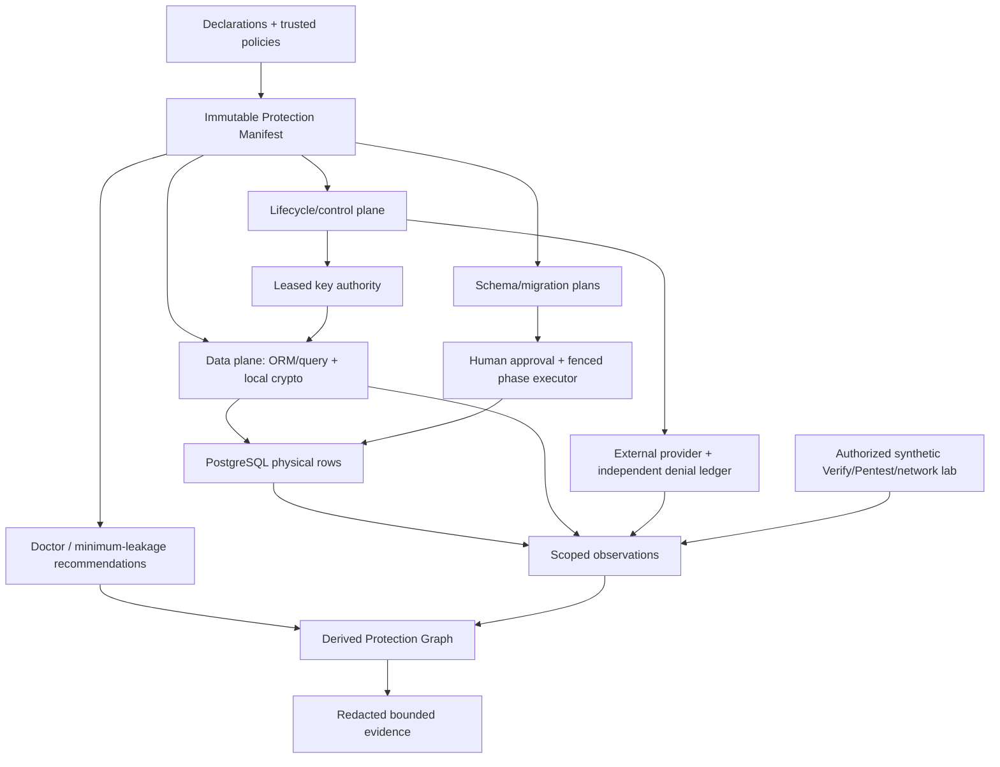
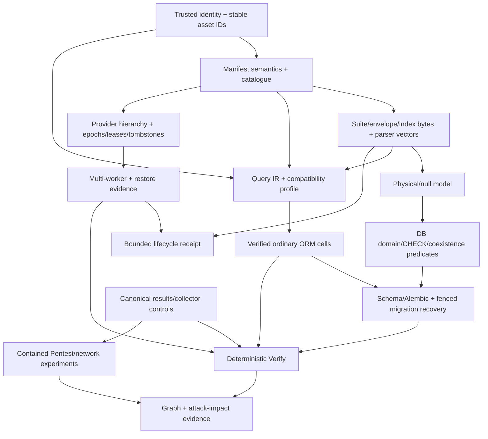

# Cryptalis architecture blueprint

Status: accepted architecture specification with empirical gates.
Reviewed: 2026-09-30. Integration corrections: 2026-10-01. Field-format boundary review: 2026-10-05. The
[checklist](../backend-build-checklist.md) is the authority for current capability state.

## Product and first target

Cryptalis is a planned data-protection and security-assurance system for Python and SQLAlchemy.
A versioned Protection Manifest defines its policy. Application engineers would retrofit
selected sensitive fields. Operators would manage keys and migrations. Reviewers would interpret
protection evidence within its stated scope.

The first application profile is a tenant-aware Python service. It uses one registered
SQLAlchemy Session/AsyncSession family, PostgreSQL, immutable record UUIDs, and explicit
authenticated grants. FastAPI is an optional host adapter. Cryptalis does not supply an identity
authority through FastAPI. The [shared glossary](manifest-context-api.md#terms-and-maturity)
defines terms and abbreviations.

The design trusts the application process, which handles plaintext. Payload protection must
happen before database persistence. Supported paths must keep unwrapped keys out of PostgreSQL
and its dumps and backups. PostgreSQL credentials and operator access must not expose those
keys.

Malware or authorized code in the trusted process can still access plaintext and keys.
Most runtime capabilities remain proposed. A complete architecture is separate from implementation evidence.

## Documentation ownership

Each detail owner below is authoritative for its contract family. This blueprint defines shared
boundaries, dependency edges, and invariant IDs. Other documents link to the contracts instead
of repeating them.

If an invariant conflicts with a detailed contract, stop the affected claim. Reconcile the
owners. Record the change. No document silently overrides another.

| Document | Audience / owns | Does not own |
|---|---|---|
| [README](../../README.md) | New users: promise, boundary, entry points | Version support/capability state/details |
| This blueprint | Integrator: product/threat model, cross-system invariants, owner map, decision rationale | Duplicate subsystem algorithms |
| [Manifest/context/API](manifest-context-api.md) | Implementer: manifest schema, provenance, maturity/glossary, modules, API/CLI/errors/config/versions | Crypto/ORM/assurance algorithm copies |
| [Crypto/search/lifecycle](crypto-search-lifecycle.md) | Security/runtime engineer: envelope, domains/leakage, providers, cache/fence/restore/receipts | Host business authorization |
| [ORM/schema/migration](orm-schema-migration.md) | ORM/database engineer: query/type/path/async/compiler/Alembic/recovery/compatibility | Provider destruction semantics |
| [Assurance/evidence](assurance-evidence.md) | AppSec/analyzer engineer: Doctor/graph/writers/Verify/Pentest/network/results/bundles/lab/benchmarks | Core field policy mutation |
| [Research philosophy](../learning-first-research-philosophy.md) | Builder: learning/evaluation/build vs integrate and broader research gates | Live technical or capability-state copies |
| [Build guide](../cryptalis-build-guide.md) | Builder: dependency-aware first files/concepts/outcomes | Competing interface definitions |
| [Checklist](../backend-build-checklist.md) | Maintainer: evidence state/dependency/exit links | Architecture rationale |
| [Prior art](../prior-art.md) | Researcher/reviewer: attribution, competitor/product thesis | Cryptalis runtime specification |
| [Assurance research](../security-assurance-suite-research.md) | Researcher: analyzer/scenario learning depth and comparisons | Second normative assurance owner |
| [Engineering playbook](../../ENGINEERING_PLAYBOOK.md) | Contributor: explicit failure and behavior-first testing policies, manual implementation, review, and release process | New architectural guarantees |
| [Claims audit](../documentation-claims-audit.md) | Reviewer: dated findings/closure/validation provenance | Architecture/status authority |
| [Historical pause handoff](../SESSION_HANDOFF.md) | Maintainer: interrupted-session chronology, superseded by audit | Live goal state or remaining design decisions |
| [Hardening dossier](../adversarial-architecture-hardening.md) | Researcher: historical hostile analysis and alternatives | Current versions or contracts |
| [ORM source ledger](../research/orm-platform-evidence.md), [crypto ledger](../research/crypto-provider-evidence.md), [tool ledger](../research/assurance-tool-evidence.md) | Reviewer: current primary evidence/version/edition/access date | Reproduced Cryptalis measurements |

## Load-bearing decisions

DECIDED specifies policy. DEFAULT requires named validation. OPEN identifies a choice that
requires an experiment. None implies working software. This decision record replaces duplicate
architecture decision record (ADR) specifications.

| ID / status | Decision, credible alternatives, consequence | Owner / falsifier |
|---|---|---|
| D01 DECIDED | Protect at the application/ORM boundary. Database encryption would trust the DB. A proxy would lose ORM semantics. Raw writers remain coverage gaps | Threat model and ORM. P2 coverage |
| D02 DECIDED | Use a normative immutable Protection Manifest and a derived Protection Graph. Decorators alone or scanner-driven policy risk drift. Observations never widen capabilities | Manifest and assurance. G-MANIFEST/G-A gates |
| D03 DEFAULT | Encrypt payloads locally after explicit warm-up or prefetch. Compare actual greenlet remote I/O and deferred batches. Reject hidden network access in the default profile | ORM async gate P3 |
| D04 DECIDED | Use randomized payloads with separate declared search representations. Reject deterministic payloads as the default because they couple encryption to repetition leakage | Crypto. P5 and search gates |
| D05 DEFAULT | Use provider KEK -> tenant branch -> wrapped subject generation. Stronger erasure requires per-subject provider destruction or a reviewed puncturable scheme | Crypto. P7 and provider gates |
| D06 DECIDED | Schema/Alembic integration emits plans only. Migrations add structures before separately authorized contraction | ORM. P6 recovery |
| D07 DECIDED | Reject unknown query semantics, context, or formats explicitly. Never fall back to plaintext or an implicit client scan | ORM and manifest. P0/P1/P2 |
| D08 DECIDED | Treat controlled evidence as first-party. An external signed witness establishes integrity and provenance, not measurement truth or independent proof | Assurance. P8 controls and value |
| D09 DECIDED | Isolate attributed known constructions in research packages. Primitive library selection requires vectors and review | Crypto and modules. P10/G-BOUNDARY |
| D10 DECIDED | Require authenticated grants from principals to tenants and subjects, plus immutable row identity. Raw IDs and ambient context cannot establish authority | Manifest G-CONTEXT/P0 |
| D11 DECIDED | Use explicit state, narrow contracts, deterministic behavior, and observable failures. Silent recovery or undefined best effort can hide invalid state. Apply the playbook policy across subsystem boundaries | [Failure policy](../../ENGINEERING_PLAYBOOK.md#fail-loudly-and-explicitly) and [error contract](manifest-context-api.md#errors-and-observability). Failure-path evidence |

For a decision change, record the predecessor ID and the primary-source or experimental basis.
Name the affected owners, consequences for manifests, formats and compatibility, and blocked
claims. Keep this information in the audit or change record.

Historical ADRs removed in cc54ee8 remain in Git history. They do not restore authority to the
former gateway-first design.

## Trust and threat model

Protected assets include logical values, subject and tenant keys, authenticated identities,
searchable metadata, policy and schema transitions, and evidence. The model trusts host
authentication adapters, the registered cryptographic library, current workload and provider
credentials, and the managed control plane.

Database contents, backups, and query inputs are untrusted. Control-plane compromise defeats the
core model. Offline keys exported by trusted workloads and malicious code inside the trusted
boundary also defeat it.

| Threat / attacker capability | Intended control and assumption | Residual exposure / verification |
|---|---|---|
| Stolen dump/backup | Randomized AEAD, root keys separate from DB | Length/IDs/index terms; extraction/canary fixture |
| Stolen DB credentials/direct SQL/overprivileged DBA | Same boundary; DB does not know unwrapped keys | Availability, deletion/replay/malformed rows, metadata; tamper/relocation tests |
| Historical valid ciphertext rollback | AEAD proves authenticity, not freshness | Freshness outside bound unless external row-version authority; rollback scenario reports this limit |
| Accidental supported-path persistence | Authenticated context, row-aware adapter and atomic companion writes | Plaintext in trusted app remains; inspect SQL/rows/mutants |
| Unregistered/Core/bulk/raw/COPY/ETL writer | Reject registered known paths, roles/framing defense, writer ledger | Unobservable separate writers; no universal prevention; P2 T/R/D/U matrix |
| Migration mistake/mixed app versions | Immutable source/target plans, row CAS/checkpoints/writer fence | Approved coexistence includes plaintext; crash/retry/two-worker fixtures |
| Cross-tenant/subject substitution | Host-authenticated grants + stable tuple in AAD and tenant filters | Host policy bugs remain risk; P0 colliding IDs/task/pool/jobs |
| Untrusted manifest/descriptor substitution | Bounded structural parsing and separate digest domains. Catalogue admission and authenticated authority required | Current helpers establish byte consistency, not policy authenticity or catalogue approval. G-MANIFEST/P0/P10 remain pending |
| Malformed or forged envelope from a database attacker | Bounded framing before key lookup. Authorized registry selection and AEAD required afterward | The private F1/W1 parsers reject malformed structure but accept well-shaped forged bytes. G-CRYPTO/G-CROSSKEY/G-AAD remain pending |
| Cache stale worker/partition | Epoch/lease authorization plus serialized DB fence and acknowledged output drain | Expiry denies new authorization; physical completion requires drain evidence and can remain pending; bytes may remain in suspended RAM; P7 chaos |
| Restore/resurrection | Independent durable tombstone/release check | Wrapped backup + surviving parent can recover offline; restore and recovery-path tests |
| Search metadata/frequency/auxiliary/chosen query observer | Capability-specific accepted leakage, explicit domains | Equality/order/token/access patterns; attacks/cost gate per capability |
| Key/provider outage | Cold deny; bounded authorized cache only | Availability and declared offline lease; outage/expiry tests |
| Artifact/log/report leak | Synthetic fixtures, redacted observations, safe errors | Transparent Python values can be logged by host code; collector controls/Doctor |
| Fully compromised application/host or malicious authorized code | Beyond core protection | Can read plaintext/keys, bypass grants; independent controlled release is separate profile |
| Business auth flaws, XSS, SQL injection itself | Host AppSec responsibility; Pentest can exercise impact | Vulnerability remains even if DB ciphertext holds; results separated |
| Deliberate post-decrypt export/unmanaged copies | Beyond technical deletion scope | Export/log/backups excluded explicitly; no universal erasure/compliance claim |

A supported-path claim names its exact prevention and compatibility scope. Detected-only and
unobservable paths remain coverage gaps, even when a clean run does not exercise them. Database
framing constraints do not authenticate writer authority or ciphertext. Passive Transport Layer
Security (TLS) capture does not prove absence of plaintext inside applications. The assurance
contract defines detailed attack models and collectors.

## Data flow and plane boundaries

The proposed write path has this order:

1. Validate the trusted grant and immutable identities for typed Python logical state.
2. Encode the payload.
3. Normalize its search value.
4. Encrypt locally under the key lease.
5. Assemble the authenticated envelope and declared search terms.
6. Set hidden physical state.
7. Execute SQL.
8. Check shape, presence, and uniqueness.
9. Emit redacted observations.

Logical state remains separate from ciphertext. Payload and search updates share a transaction
boundary.

The proposed read path has this order:

1. Parse the physical row within strict bounds.
2. Validate the grant, ownership, requested resource, and format compatibility.
3. If the required generation is cold, warm it explicitly.
4. Authenticate the context tuple.
5. Decode the payload.
6. Release a Python value or an opaque controlled value.

The path releases no unauthenticated bytes. The verifier also checks normalized search
predicates and companion terms. An authenticated row that fails the predicate invalidates the
whole buffered result. Search completeness and index consistency require separate verification.
Authenticated encryption with associated data (AEAD) alone cannot detect a missing search hit.

The schema compiler consumes the manifest, model metadata, live snapshot, and catalogue. It
emits a plan only. Migration and lifecycle executors mutate state only under explicit operation
grants and fences. Analysis consumes facts and emits proposals. Evidence cannot change policy.

[Manifest contracts](manifest-context-api.md#packages-and-dependency-direction) define module
import direction and forbidden dependencies.

## Integration dependency DAG

Edges govern integrated claims. Isolated research can start independently. Cryptographic
envelope framing and parser semantics must precede database rejection of plaintext-shaped values
(W-3). Provenance must precede key selection and protected SQL (W-5). An integration cannot use
a failed dependency as evidence.

## 23. Canonical security invariants

The stable IDs below identify normative design requirements. These properties are not yet
proven. Evidence must bind source, manifest, schema, deployment, and tool versions to an exact
interval and scope. Each owner describes the mechanism. Future scenarios reference the invariant
ID instead of maintaining a duplicate catalogue.

| ID / invariant | Mechanism / owner | Test/adversary/evidence | Failure state |
|---|---|---|---|
| I01 Supported writes never intentionally persist plaintext | Row-aware transform + atomic physical state / ORM | Positive round trip; plaintext-write mutant; SQL+row collector | Abort transaction; capability claim blocked |
| I02 Unknown semantics never silently broaden/fallback | Typed query IR/path catalogue / ORM | Every operator/bypass family; emitted SQL confirms no execution for reject paths | UnsupportedEncryptedQuery or visible coverage gap |
| I03 Payload authenticates stable tenant/subject/record/field/format | Strict AAD/AEAD / crypto | Bit tamper, relocation, identity moves, unknown format vectors | Authentication/format error, no value |
| I04 Representations exist only for declared capability | Manifest compiler/domain policy / crypto+ORM | Undeclared query/index mutant; schema/term inventory | Compile/query rejection or drift failure |
| I05 Key purposes/domains are separated | Versioned derivation labels / crypto | Cross-purpose/tenant/domain vectors and collisions | Key/domain mismatch; no release |
| I06 Remote I/O is visible in selected profile | Explicit warm default; bridged/deferred gates / ORM | Event-loop lag/cancellation/N+1/provider traces | Cold/error typed, no hidden fallback |
| I07 Identity has authenticated provenance | Immutable grant + tenant/ownership scope / manifest | Colliding IDs, jobs/tasks/pools/identity-map substitutions | Pre-key/pre-SQL Context error |
| I08 No new operation authority after declared fence; physical completion requires drain | Epoch/lease authorization, serialized commit fence and acknowledged sink drain / lifecycle | Partition/suspend/resume/cache/grant expiry; timestamped operation evidence | Denied/pending, never false completion |
| I09 Supported restores consult independent denial | External ledger + current release policy / lifecycle | DB/control snapshot rollback and stale queue; fresh/stale decrypt | RestoreDenied/INCONCLUSIVE; offline recovery caveat |
| I10 Migration never completes with inconsistent unverified state | CAS/checkpoints/complete coverage/fenced cutover / ORM | Crash every phase, mixed writers, invalid index, unique conflicts | Paused/repair; contraction denied |
| I11 Missing/failed collectors never create absence PASS | Health/watermarks/positive-negative-mutant controls / assurance | Drop/redact/timeout collector and seed exposure | INCONCLUSIVE for affected claim |
| I12 Evidence does not become sensitive-value repository | Synthetic oracle + redacted digest-based exports / assurance | Seed value/key/token/credential leak in bundle mutant; retention/access checks | Bundle quarantine; release blocked |

## Fatal risks and resolution gates

The historic P0-P10 IDs retain meaning but detailed current gates live at canonical owners:
[context/manifest/API](manifest-context-api.md#version-compatibility-and-research-gates),
[ORM/async/query/schema/migration](orm-schema-migration.md#research-gates),
[crypto/search/lifecycle](crypto-search-lifecycle.md#research-gates), and
[assurance/evidence](assurance-evidence.md#research-gates). The IDs retain these meanings:

| Risk | Meaning |
|---|---|
| P0 | Identity provenance |
| P1 | ORM state |
| P2 | Bypass coverage |
| P3 | Actual async alternatives |
| P4 | Authorized identity migration |
| P5 | Race-safe equality and uniqueness |
| P6 | Migration recovery |
| P7 | Lifecycle and restore |
| P8 | Oracle and Protection Graph value |
| P9 | Doctor usefulness |
| P10 | Suite freeze |

Each gate names alternatives, fixtures and evidence, pass/fail thresholds, blocked claims, and
safe independent work.

Stop the affected claim if any of these conditions occurs:

- Unauthorized context selection, ambiguous identity, or silently changed query semantics
- Claimed support that requires private framework APIs
- An unfenced old writer or stranded migration of additional authenticated data (AAD)
- Non-atomic uniqueness, unbounded cache use, or restored access that should remain denied
- A fabricated absence result, uncontained active traffic, or sensitive evidence bundle
- An advanced construction without a credible oracle and review

Redesign the affected profile or demote its maturity. Failures in Doctor noise, maintenance,
usability, or Protection Graph value narrow the affected product claim. They do not prohibit an
isolated learning experiment. Recoverable key paths block strong-erasure claims.

## Claim and compatibility discipline

No package or profile is supported today. [ORM contracts](orm-schema-migration.md) list
candidate runtime versions and public extension APIs. Linked ledgers contain dated source
observations. A reference version is a test input, not a guarantee.

Claims require separately reviewable definitions and evidence. This applies to coverage of all
SQLAlchemy operations, security scores, zero leakage, complete erasure, complete static or
dynamic application security testing (SAST/DAST), breach prevention, compliance, and first,
only, or novel claims.

Assumptions about dominant performance costs are hypotheses for the [benchmark
protocol](assurance-evidence.md). Competitor comparisons require equivalent workloads,
deployments, and threats. The proposed research contribution is correlation with explicit
unknowns. It is not a novelty assertion.
