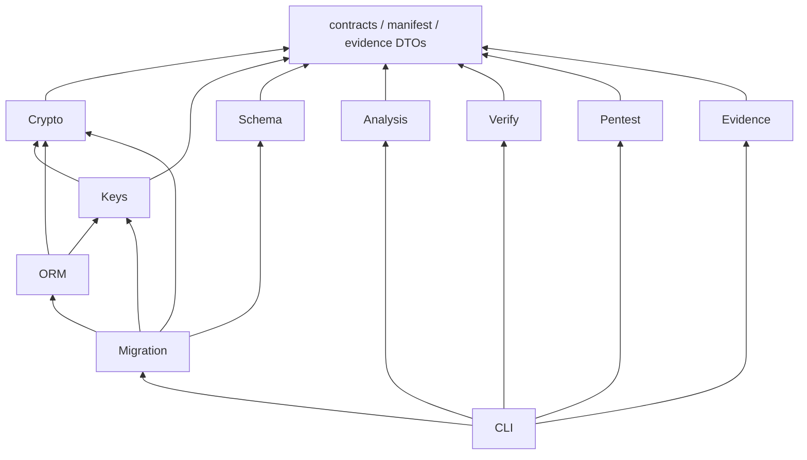

# Manifest, identity, and public contracts

Status: specified design with initial manifest JSON and inspection support. Most interfaces
remain proposed. Reviewed: 2026-10-05.

This document defines manifest semantics, identity provenance, shared versions and errors,
public APIs, CLI commands, configuration, and module contracts. The [blueprint](README.md)
assigns detailed subsystem contracts to their owners.

## Terms and maturity

| Term | Exact meaning |
|---|---|
| Protection Manifest | Immutable, versioned field policy compiled from declarations. Runtime observations cannot change this policy |
| Protected field | Stable logical ID with declared authenticated payload/context and optional search representations |
| Logical value / physical representation | Typed application value / persisted envelope, identity, and declared companion structures |
| Envelope | Versioned payload framing with size bounds. Authentication requires an authorized key and context |
| Capability / index domain | Declared operator/construction contract / authorized key and normalization correlation scope |
| Protection Graph | Derived observations and unknowns, with recorded provenance. It has no policy authority |
| Key cache / provider | Bounded key material with separate leased authority / registered external custody adapter that preserves service semantics |
| Shred | Destructive lifecycle request with explicit scope. Managed denial and recovery-path conclusions are stated separately |
| Transparent | Ordinary Python value inside an enumerated ORM path. Applications and serializers receive plaintext |
| Controlled access | Opaque value that requires a release grant bound to purpose and principal. A local wrapper alone guards against accidents |
| Supported path | Released exact version/operation/loader/context cell with compatibility evidence and maintenance commitment |
| Coverage gap | Unsupported, unknown, detected-only or unobservable path excluded from the protection claim |
| Production profile | Approved construction, library, and deployment policy. Proposed policy does not establish support |
| Research profile | Isolated attributed experiment with threat/leakage model, oracle and exit gate |
| Educational implementation | Known technique independently implemented for learning. It never enables production use implicitly |
| Verified capability | Named property on pinned scope with successful controls and reproducible evidence |
| Tenant / subject / record | Authorized isolation domain / lifecycle owner / immutable payload-row identity |
| Generation / epoch / lease / fence | Key-material version / authorization revision / bounded operation authority / stale-operation rejection token |
| Tombstone | External durable denial that supported release and restore paths check. It does not destroy backed-up bytes |
| Evidence / collector | Provenanced observation / registered scoped observer with health and interval boundaries |

Maturity applies to each capability. The [checklist](../backend-build-checklist.md) records
current state. The ladder is cumulative:

| Level | Required basis |
|---|---|
| IDEA | A question |
| RESEARCHED | Primary-source alternatives |
| SPECIFIED | Interfaces, failures, and an acceptance gate |
| PROTOTYPED | A disposable executable artifact |
| IMPLEMENTED | A maintained artifact |
| TESTED | Pinned controls and mutants |
| MEASURED | Raw benchmark results |
| REVIEWED | An identified independent reviewer and resolved findings |
| PRODUCTION_CANDIDATE | Required correctness, lifecycle, migration, safety, and review gates |
| SUPPORTED | Released exact compatibility cells, upgrade and deprecation policy, and maintenance commitment |

A documentation pass establishes at most SPECIFIED. Research intent is a separate axis. A
verified property names its evidence and scope. It does not advance unrelated capabilities.

Abbreviations used across these contracts include:

| Abbreviation | Meaning |
|---|---|
| AAD | Additional authenticated data |
| AEAD | Authenticated encryption with associated data |
| AST | Abstract syntax tree |
| CAS | Compare-and-swap |
| CFG | Control-flow graph |
| CLI | Command-line interface |
| DAST | Dynamic application security testing |
| DB | Database |
| DDL / DML | Data definition language / data manipulation language |
| DTO | Data transfer object |
| ETL | Extract, transform, load |
| IAM | Identity and access management |
| IR | Intermediate representation |
| JCS | JSON Canonicalization Scheme |
| JWT | JSON Web Token |
| KDF / KEK / KMS | Key derivation function / key-encryption key / key management service |
| ORM | Object-relational mapping |
| PCAP | Packet capture |
| PK | Primary key |
| RPC | Remote procedure call |
| SAST | Static application security testing |
| SDK | Software development kit |
| TLS / TTL / UUID | Transport Layer Security / time to live / universally unique identifier |

[RFC 5116](https://www.rfc-editor.org/rfc/rfc5116) also calls AAD associated data. The contracts
use AAD for context authenticated with the ciphertext, including identity and format bindings.

## Manifest semantics

The compiler turns authoring declarations into an immutable ManifestDocument offline. It takes
declarations, mapped metadata, an explicit version catalogue, and a compiler version. It returns
a canonical document, digest, diagnostics, and a map between logical and physical
representations.

Runtime observations cannot add capabilities. The manifest contains no secrets, personal values,
key bytes, credentials, or mutable worker or provider state.

Canonical bytes use UTF-8 RFC 8785 JCS and ASCII property names. Duplicate keys, lone
surrogates, NaN, floats, and unknown semantic fields are forbidden. Counters are integers in
0..2^53-1. Larger application integers use typed decimal strings.

Stable IDs are lowercase UUIDs. Bytes use unpadded base64url. Digests use lowercase,
64-character SHA-256 hexadecimal strings. Set arrays sort by stable ID or ASCII enum and reject
duplicates. Ordered arrays retain order. Strings retain their values without implicit Unicode
normalization.

Optional absence differs from explicit null. Null is permitted only where declared. The manifest
digest is SHA-256 over this sequence:

1. The ASCII label `cryptalis-manifest-v1`
2. One zero byte
3. Canonical document bytes, excluding the detached digest and signature

Hash equality does not establish signature authenticity. RFC 8785 is informational.

Initial `digest_manifest_json` support implements the exact domain prefix and lowercase
hexadecimal result. It hashes every supplied member. The caller must keep a detached digest or
signature outside the supplied object. The helper does not establish complete semantic validity.

The parser enforces these limits:

- Document size: <=16 MiB
- Nesting depth: <=32
- Fields: <=10,000
- Capabilities per field: <=64
- Identifier size: <=128 UTF-8 bytes

Exceeding a limit raises ManifestInvalid. The parser rejects unknown critical extensions. Schema
v1 has no executable extensions. Changes require schema and catalogue compatibility review.
G-MANIFEST still requires canonical vectors across languages and fuzz evidence.

Initial `decode_manifest_header` support validates the four required identity-header
representations for schema version 1. Revision numbering starts at 0. Revision 0 is the genesis
revision and requires `parent_digest: null`. Each later revision requires a canonical parent
digest. This local rule does not prove parent existence, digest agreement, or complete ancestry.
The decoder does not validate the remaining schema or catalogue references.

R means required after compilation. C means required when the capability is selected. O means an
annotation. All referenced enums and policies resolve in the pinned catalogue. Compilation
rejects missing required fields, ambiguity, unresolved references, and incompatible profiles.
The defaults below are explicit. The compiler never guesses them.

Each field uses the canonical encoding rules above.

| Field / scope | Need and representation | Version/change consequence |
|---|---|---|
| schema_version, manifest_id, revision, parent_digest | R integer, UUID, monotonic integer, digest/null at genesis | Compatible parser; never overwrite old revision |
| compiler_version, catalogue_digest | R exact release + digest | Recompile/diff; changed semantics require migration |
| models: model_id, table_id, module/qualified_name, database_schema/table_name | R stable IDs + locator strings | Name change preserves IDs; ownership move reviewed |
| fields: field_id, attribute, python_codec, original_sql_type | R UUID, name, codec/version, dialect/type/parameters | Codec/type change needs vectors and migration |
| tenant_locator, subject_locator, record_locator | R typed attribute locator + derivation-policy ID/version | Identity changes require authorized re-encryption |
| provenance_policy | R issuer/adapter IDs and versions, principal/workload classes, actions/purposes, grant lifetime | Widening security-reviewed, tightening deployment-gated |
| access_mode, protection_profile, classification | R transparent/controlled; catalogue IDs/enums | Consumer, serialization and release-policy review |
| suite_id, envelope_version, kdf_domain_version | R numeric catalogue IDs | New writes plus explicit old readable formats |
| normalization | R type codec/version, Unicode/case/whitespace policy | Search reindex; payload preserves original value |
| null_policy | R sql_null/encrypted_null + uniqueness rule | Schema/query/index migration; null differs from empty |
| capabilities | R array (empty=no search); operator/construction/version/domain/leakage acceptance/limits | Addition requires query/leakage/cost/lifecycle review |
| equality, uniqueness, join_domain | C capability ID; scope/null policy; shared-domain UUID/participants | Race-safe dual-index transition on key/domain changes |
| range, text_prefix, structured | C construction/version, operator subset, token budget, candidate verification/path policy | Research catalogue until individual gates pass |
| physical_mapping | R columns/tables/types/length/null/index/constraint specs + naming version + nonrecycled uint32 storage/term slots | Collision rejects; reviewed schema diff |
| key_scope, key_policy, cache_policy, lifecycle_policy | R scope/provider IDs/purposes; TTL/lease/capacity/offline; restore/shred policy | Provider state external; safety review on changes |
| migration_policy, previous_readable_formats, compatibility_requirements | R protocol versions, suite/envelope/codec/index tuples, version catalogue digest | Old-reader removal needs evidence/approval |
| migration_binding | C migration ID/source/target digests + admitted state set | Actual phase/cursor belongs to checkpoint, not policy mutation |
| registered_writers, supported_query_paths, evidence_collectors | R policy/compatibility/collector ID arrays | Empty means no declared coverage; observation never registers |
| retention, shred_behavior, search_residue_behavior | R policy IDs, resources/exclusions, searchable/strict_shred profile | Technical assertion excludes legal erasure and unmanaged copies |
| description, source_locations | O text and source revision/path/span | Revision/digest changes; no automatic payload re-encryption |

### Immutable field-format descriptor

A descriptor is a separate immutable JCS object. It permits no extensions or annotations. Every
property below is required:

| Property | Representation |
|---|---|
| `descriptor_schema` | Integer 1 |
| `model_id`, `table_id`, `field_id` | Lowercase UUIDs |
| `access_mode` | `transparent` or `controlled` |
| `suite_id`, `envelope_version` | Catalogue integers |
| `kdf_domain_version`, `aad_binding_version` | Catalogue integers |
| `codec_entry_id`, `codec_version` | Catalogue integers |
| `codec_parameters` | Object validated by the exact codec's schema. Empty when parameterless |
| `null_policy` | `sql_null` or `encrypted_null` |
| `identity_encoding_version` | Integer 1 for UUID identity bytes |

Numeric IDs are 1..65535, except descriptor and identity versions. The selected format catalogue
adds narrower constraints. F1 suite and envelope selectors fit u8. Only its enumerated candidate
values are valid. The generic range cannot admit an unknown suite, unknown format, or overflow
of a narrower field.

The catalogue binds one immutable codec entry ID to a codec/version pair. Reusing an ID with
different bytes is forbidden. `codec_parameters` can constrain decimal scale/range, never supply
runtime values or executable code.

The creation-policy digest is SHA-256 over ASCII `cryptalis-field-format-v1`, one zero byte, and
the restricted JCS bytes of exactly this object. Its stable IDs bind the logical field.

The digest excludes search normalization and constructions, physical names, descriptions and
source locations, writer and collector lists, current grants and epochs, and cache leases. It
also excludes provider endpoints and the whole-manifest revision. These members do not redefine
payload encoding or AAD.

Changing an included member creates a new digest. The change requires an explicitly approved
readable tuple or a re-encryption migration. Search-policy changes require their own
representation migration. Tightened current authorization still applies to old data.

Store exact descriptor bytes and their catalogue interpretation in immutable manifest history,
keyed by digest. The active manifest lists accepted creation digests in
`previous_readable_formats`. It also lists the corresponding suite, envelope, codec, KDF, and
AAD tuples.

A header-selected digest is only a lookup hint until authorization and authentication succeed.
An unknown, altered, unlisted, or incompatible descriptor fails before key release. A descriptor
cannot cause dynamic imports, trial keys, or provider selection.

Never replace the creation-policy digest with the current whole-manifest digest. Adding an
unrelated field must not strand ciphertext. The full manifest digest still binds grants, plans,
and evidence. [Crypto contracts](crypto-search-lifecycle.md) define exact payload and envelope
bytes.

Validate the deployed manifest, schema, and catalogue at session creation, query, flush, key
authorization, and migration transitions. Drift fails closed. G-MANIFEST covers exact
descriptor/hash vectors, unrelated annotation changes, revoked old descriptors and unknown
codec/parameter substitutions.

A valid synthetic manifest fixture must contain every R/C record above; abbreviated declaration
snippets are not deployable manifests. G-MANIFEST must produce independently checked fixture
bytes.

## Trusted context provenance

The host owns authentication and business authorization. Cryptalis consumes explicit attestation
of those decisions. Correct encryption does not establish authorization. A trusted adapter is
configured application code. A request cannot select its import.

The host adapter must validate token authority in this order:

1. Validate the issuer, audience, algorithm, and key.
2. Validate expiry and purpose.
3. Validate current tenant membership and action policy.

If the host uses JWTs, apply RFC 8725 checks for token confusion, algorithm, and audience. An
authenticated principal still requires authorization for the selected tenant, subject, resource,
action, and purpose.

An immutable ProtectionGrant binds its ID and issuer/version to a principal and authentication
basis, workload, selected tenant, and subject-derivation rule/version. It also binds operations
and purposes, manifest digest, allowed key and index generations, epoch, issue and expiry times,
request or job ID, audience, and optional resource set. It contains no plaintext or keys.

A trusted in-process adapter creates an opaque authorized handle. Exported and job grants are
signed and audience-bound. They require fresh policy and epoch checks. Python constructors and
signatures cannot constrain malicious code inside the trusted process. That threat remains
outside the core guarantee.

| Identity | Authority | Required relationship |
|---|---|---|
| Principal | Host authentication adapter | Validated session/token/workload; raw headers insufficient |
| Authorization scope | Host policy adapter/service | Explicit principal permissions for tenant/resource/action/purpose |
| Tenant | Grant issuer after membership check | Exactly one authorized selected tenant per ordinary session |
| Subject | Authorized persisted ownership or creation policy | Data owner can differ from principal; tenant binding mandatory |
| Record | Creation allocator / immutable persisted UUID | Exists before encryption; mutable/request-selected PK insufficient |
| Request | Trusted middleware | Correlation only, grants no authority |
| Workload/provider | Workload IAM + provider registry | Separate credential; arbitrary envelope key locator rejected |
| Job | Trusted enqueue service + authenticated worker | Bounded signed intention, expiry/replay policy, current authorization |

A FastAPI middleware or dependency must use this order:

1. Authenticate the principal.
2. Authorize the requested scope.
3. Construct the grant.
4. Open the session.
5. Close the session in finally, including after success, error, or cancellation.

A tenant ID in a request body, path, or header requests a selection. It does not establish
authority. Compare that ID with authorized membership. Resolve the row and subject within the
selected tenant with a parameterized, scoped query.

Database metadata is not an integrity authority. Authenticated ownership and AAD must agree. New
rows use the declared, authorized creation policy. Legacy rows require an independently reviewed
ownership source. Ambiguous legacy ownership blocks backfill before key lookup.

Creation allocates a random immutable record UUID and authorizes or derives the subject. Flush
rejects identity mutations. Reads apply tenant filtering before identity-map reuse. They
validate the subject, record, and field before release.

Subject-scoped grants reject other subjects. Authorized tenant-wide grants resolve rows by the
declared ownership rule. PKs remain relational IDs. The record UUID prevents confusion with
mutable or namespaced PKs. A tenant or subject transfer requires explicitly authorized
decryption and re-encryption through a migration. Editing an ID is insufficient.

A session cannot switch tenant or manifest authority. Administration uses separate batches. The
identity-map mechanism must pass G-ORM, whether it uses a tenant strategy or globally unique
UUIDs with compulsory scoping. Context alone does not solve identity-map isolation. Pooled
connection state never establishes authorization authority.

### Requested resource binding

Point loads, refreshes and identity-map reuse require `ResourceBinding`: issuer/version, tenant,
table ID, immutable expected record UUID, canonical relational-locator digest, allowed subject
or ownership rule, purpose/action, manifest digest and expiry. The host authorization adapter
issues it only after verifying an authenticated resource mapping or a creation receipt.
Requested PKs and all ownership/record columns from the same mutable database row cannot attest
their own correctness. The default mapping authority is a host-managed authenticated registry
independent of application DB restore, not a new Cryptalis authentication service. The host may
instead authorize immutable record UUIDs directly as resource identifiers. Both alternatives
must pass G-CONTEXT before support.

For composite locators, the host's pinned codec encodes ordered column-ID/typed-value pairs with
restricted JCS. The locator digest is SHA-256 over ASCII `cryptalis-resource-locator-v1`, one
zero byte, and those bytes. This digest is not a searchable representation.

Creation allocates the UUID first. It authorizes the tenant and subject, then registers the
binding as pending. The host activates the receipt only after confirmed persistence. It
reconciles an ambiguous commit by UUID and denies pending or orphan mappings.

Changing a locator requires an authorized mapping transition. Changing tenant or subject also
requires re-encryption. Mapping outage or ambiguous legacy ownership raises Context.Unavailable
or Context.Conflicting, respectively.

Compare the trusted expected UUID, tenant, field and authorized subject against
parsed/authenticated row context before release, including cached/relationship loads. Replacing
ciphertext plus every key/subject/record companion while retaining the requested PK must fail.
No trusted binding means point-load release is rejected, not guessed from relational metadata.
Host mapping correctness is an explicit trust assumption; cryptography cannot fix a dishonest
host authorization adapter.

Tenant-wide discovery queries may release only individually authorized authenticated rows and
must verify declared search predicates after decryption. This establishes field/identity
self-consistency, not malicious-DB completeness, relational-locator integrity or freshness.
Omission, reordering and same-identity replay remain outside this query profile. Consumers
requiring exact requested-resource membership use the point-binding profile; broad grants do not
silently imply that stronger guarantee.

ContextVar transports a handle. Each protected operation validates it. Task creation must clear
authority or deliberately derive a narrower grant. Copied context does not establish authority.
Detached decryption requires explicit valid context. Expiry invalidates operation handles,
although bounded cache bytes can remain.

Background and service accounts use separate workload grants instead of serialized tenant IDs.
Recheck membership and epoch at job start, resource acquisition, and the commit fence.
Migration, maintenance, and restore require separate IAM identities, approved transitions, and
short-lived tenant batches. Web principals cannot get these grant classes. The production
catalogue excludes the synthetic test issuer.

Missing, conflicting, expired, unauthorized, or unavailable provenance fails before provider
load or protected SQL. Authorized two-phase reads can fetch bounded hidden ciphertext before
warming subject material. They cannot bypass grant or resource validation or release plaintext
before authentication. A policy timeout raises ContextUnavailable and denies the operation. No
zeroization claim covers Python values.

## Public Python surface

These names are proposed and unavailable today. The contracts freeze semantics, not class
internals. Imports must cause no network I/O or schema mutation. Sync and async variants have
identical authorization rules.

| API | Inputs -> outputs; lifetime/I/O | Preconditions/errors/consequence |
|---|---|---|
| protect(model, declaration) | Mapped class + typed policy -> declaration; startup sync/offline | Stable IDs/types/context; ManifestInvalid; enforcement starts only after install |
| compile_manifest(declarations, metadata, catalogue) | -> immutable document/diagnostics/map; offline sync | Deterministic G-MANIFEST; no secrets/live DB |
| authorize(principal, intent, policy) | -> opaque grant; explicit await if policy remote | ContextUnauthorized/Unavailable/Expired; unchecked requested IDs rejected |
| register_provider(id, adapter, policy) | -> registry entry; startup, no implicit network | Duplicate/unknown ID rejects; preserve provider semantics |
| warm / awarm(grant, key_requests) | -> leased KeySet handle; explicit sync/await | Bounded tenant/subject/purpose/generation; unavailable/denied/stale typed errors |
| protected_session / aprotected_session(factory, manifest, grant, keyset) | -> context-managed Session/AsyncSession; explicit operation admission at execute/flush/commit | One task/tenant; validate versions/schema/lease before SQL; rollback closes handles |
| reveal / areveal(value, grant, purpose) | ControlledValue -> logical value, bounded release | Stronger profile needs independent release authority; denial releases nothing |
| compile_schema(manifest, metadata, snapshot, catalogue) | -> SchemaPlan/findings; offline deterministic | No DDL/key bytes; drift/unsupported transforms explicit |
| plan_migration(source, target, snapshots, writers) | -> immutable MigrationPlan | Phase approvals/evidence; no production auto-apply |
| request_lifecycle(scope, operation, grant, idempotency_key) | -> durable operation ID/state | Rotation/revoke/shred separate; polling explicit; scope conflict typed |

A key request binds the provider, tenant, subject, domain, purpose, and generation. It also
binds a policy-selected quota for invocations and encoded bytes. The quota includes
`usage_reservation`, requested counts and bytes, and allocation expiry.

Warm returns material, separately scoped allocation and lease IDs, and remaining local quota. A
cached key alone grants no quota. Explicit warm-up or preparation reserves durable quota. Scalar
hooks consume the quota locally and never refill it.

Session execute, flush, commit, and controlled reveal require operation admission before local
scalar or flush work. Sync callers incur the declared control-plane wait. Async wrappers
explicitly await it. These boundaries register output and commit permits, validate quotas, and
warm required keys. They do not create an undeclared bridge from scalar hooks to providers.

Operation records remain pending until managed output handoff or reconciled commit or abort.
Provider-call counts and control-authority calls are separate latency and availability metrics.
Authority outage denies new operation admission even when provider material is cached. Cached
preparatory cryptography grants no output permission. The [lifecycle
owner](crypto-search-lifecycle.md) specifies drain and reservation limits.

Warm cannot prefetch unknown future subjects. An unknown-row query must fetch hidden rows, run a
bounded explicit awarm batch, then decode descriptors. Otherwise, it rejects cold access. The
default has no hidden scalar network I/O. Tenant search keys must be warm before the query.
Two-phase cancellation and lifetime correctness remain subject to the ORM gate.

The proposed adoption flows are:

| Task | Flow |
|---|---|
| New field | Declare and review the profile and context, review generated schema, then run Verify |
| Retrofit | Inspect, plan, expand, coexist, backfill, verify, cut over, observe, and contract |
| Equality search | Review leakage, then migrate the index |
| Rotation | Maintain an explicit old-reader set |
| Incident | Revoke and fence access |
| Delete | Issue a receipt with bounded scope |
| Debugging | Explain rejected query IR |
| CI | Use pinned snapshots |
| Review | Verify evidence identities, controls, and exclusions |

Subsystem owners define operational steps. This table is a flow summary, not an executable
procedure.

## CLI and configuration

The proposed CLI uses these shared exit codes:

| Code | Meaning |
|---|---|
| 0 | All requested applicable checks PASS, or a read-only proposal is emitted with no blocking diagnostic |
| 1 | FAIL |
| 2 | Invalid input, configuration, or authorization |
| 3 | WARNING, INCONCLUSIVE, or incomplete coverage |
| 4 | Operationally unavailable or cancelled |
| 5 | Only NOT_APPLICABLE or NOT_RUN |

Plans record kind=proposal. They never record security PASS. Combined results use precedence
2,4,1,3,5,0. Machine JSON preserves each result dimension.

| Command | Inputs -> outputs | Defaults/network/authorization |
|---|---|---|
| doctor | Source/config/manifest/optional snapshot -> findings/coverage JSON/SARIF | Offline, no importing arbitrary app code; live DB explicit read-only grant |
| plan | Declarations/static/runtime/schema -> minimum observed capability proposal | Read-only; never changes policy |
| schema explain | Field + manifest/snapshot -> physical/leakage/version facts | Offline; live read-only introspection explicit |
| migrate plan | Source/target/schema/writers -> recovery/lock/compatibility proposal | No apply; network acquisition read-only explicit |
| verify | Pinned fixtures/scenarios/collectors -> bounded property bundle | Structural offline default; fixture execution authorized; no production destruction |
| pentest | Authorization + deployment + scenario -> results/replay | Passive imported evidence default; explicit active interlocks below every engine |
| evidence inspect/validate/export | Bundle + trust policy -> findings/format | Offline; log/signature network explicit; no implicit upload |
| check --ci | Pinned workspace/snapshots -> passive composition | No scan/key mutation/network default; Verify only preauthorized fixtures |
| keys rotate/revoke/shred; status | Scope/grant/idempotency -> durable state/receipt | Mutations named explicitly; status read-only; nothing hidden under scan |
| manifest inspect | One local file -> identity header and digest in text/JSON | Offline and read-only; bounded regular file; partial schema scope |

The initial `manifest inspect` command reads one bounded local regular file. It emits the
validated identity header and computed digest as text or JSON. Invalid input returns code 2 with
a redacted `Manifest.Invalid` record. This command implements only the documented header scope.
It does not complete C25 or establish full semantic validity.

Declarations compile policy. Project configuration selects the digest, catalogue, provider IDs,
and output paths. Deployment configuration supplies endpoints, credential references, and
restrictions. Runtime context supplies grants. Lab authorization supplies targets and budgets.
It cannot widen production policy.

Presentation and operational settings use default -> project -> deployment -> CLI precedence.
Effective security policy is the intersection of the manifest, deployment restrictions, current
grant, and lifecycle state. Conflicts reject the operation. CLI options and environment
variables cannot add search, bypass provenance, extend leases, or disable safety.

Credential providers resolve secrets. Manifests and reports do not contain them. Evidence
includes a digest of the redacted effective configuration.

## Errors and observability

Stable errors contain a family and code, redacted public reason, retryable flag, and correlation
ID. Never interpolate values, tokens, keys, ciphertext, or request payloads into these errors.

| Family | Codes / retry behavior |
|---|---|
| Manifest | Invalid, UnsupportedVersion, DigestMismatch; recompile/review |
| Context | Missing, Unauthorized, Expired, Conflicting, Unavailable; independently get fresh authority |
| Envelope | Malformed, UnsupportedFormat, AuthenticationFailed, Oversize; fail/quarantine, never NULL fallback |
| Key/provider/cache | Unavailable, Denied, Revoked, Shredded, StaleLease, GenerationMismatch, ColdMaterial, QuotaExhausted; bounded availability retry after authorization |
| Codec | InvalidType, InvalidValue, Oversize; input rejected before encryption/DML, never coercion or truncation |
| Execution | CommitAmbiguous; reconcile durable operation/record identity before replay |
| Query planning | UnsupportedEncryptedQuery, DomainMismatch, UnboundContext; pre-SQL failure, no scan/broader index |
| Query result | IndexInconsistent; detected after bounded fetch/authenticated decode; fail the whole buffered result with no partial logical release |
| Schema/migration | Drift, UnsupportedTransform, Conflict, UniquenessConflict, UniquenessCollision, Paused, RepairRequired, Irreversible; operator recovery |
| Lifecycle | ScopeConflict, FenceLost, PendingExternal, RestoreDenied; resume idempotency record or deny |
| Analysis/evidence/safety | ParseGap, UnknownFlow, CollectorUnavailable, IntegrityFailure, TargetUnauthorized, BudgetExceeded; gap preserved |

Retry a provider or database outage only within the deadline and idempotency contract. Quota
exhaustion raises Key.QuotaExhausted before protected DML or output. Prepare quota explicitly. A
scalar hook never refills it.

If commit status is unknown, inspect durable identity before replay. Never replay silently.
Index inconsistency invalidates the result or statement. No affected write transaction commits.
The session requires rollback/closure before reuse under the ORM contract. The contract leaves
open whether IndexInconsistent requires rollback, session closure, or both.

Index inconsistency blocks cutover and records an evidence failure. Ordinary AEAD reads cannot
prove search completeness. Schema drift or an incompatible old application stops writes.
Analyzer uncertainty remains unknown. Collector failure makes related negative results
INCONCLUSIVE.

Allowed telemetry includes digests, versions, error codes, durations, provider and cache counts,
migration phases, lease ages, and coverage. Pseudonymous IDs have bounded cardinality. Telemetry
must exclude protected values, raw search tokens, keys, credentials, payloads, and ciphertext
bodies.

Transparent read diagnostics cannot create an undeclared synchronous network dependency.
Controlled access and lifecycle decisions obey their explicit durable audit policy.

## Packages and dependency direction

The responsibility names below define the proposed package structure. Initial manifest decoding,
canonical output, content digests, identity-header validation, and offline terminal inspection
exist. The
[checklist](../backend-build-checklist.md) records implementation state. Shared immutable
contracts, including evidence DTOs, sit below adapters. Evidence orchestration and rendering sit
above adapters. The CLI composes use cases and defines no security semantics. No domain layer
imports a scanner or SDK.

| Module | Public seam and allowed dependencies | Invariant/errors/test layer |
|---|---|---|
| contracts + manifest | IDs/versions/DTOs/parse/compile/diff; stdlib + reviewed codec only | Deterministic policy / Manifest / vectors+fuzz |
| crypto | envelope/AEAD/KDF/codec/search; contracts+reviewed crypto, no network/ORM | Authenticated release / Envelope / vectors+tamper |
| keys | provider/leased handles/lifecycle/tombstones; contracts+wrapping, no ORM/analysis | Scoped fence / Key / stateful chaos |
| sqlalchemy | mapping/descriptors/query/context; contracts+crypto+key interfaces+ORM | Logical/physical coherence / Query+Context / compatibility |
| schema | snapshots/physical compiler/drift; contracts+metadata adapter, no keys/DAST | Plan only / Schema / DB fixtures |
| alembic + migration | operations/checkpoints/backfill; schema+crypto+keys+ORM migration adapter | CAS/fence/recovery / Migration / crash+DDL |
| doctor + plan | IR/taint/rules/recommendations; contracts+read-only facts, no decrypt/policy mutation | Unknown preserved / Analysis / labeled corpus |
| verify | scenarios/oracles/collectors; contracts+explicit fixture adapters | Scoped controls / Evidence / mutants |
| pentest + network | lab scenarios/adapters/correlation; contracts+safety broker+evidence DTOs | Containment / Safety / scope-escape fixtures |
| evidence | validate/render/import/attest; contracts+interchange/signature libs, no implicit execution | Integrity distinct from truth / Evidence / parsing+redaction |
| cli + integrations | use-case composition/typed optional adapters; public interfaces only | Visible action/I/O / mapped errors / integration |
| experimental/lab distributions | Known constructions/scenarios; contracts+research adapters | Production cannot import / unsupported profile / differential |

An arrow means the source depends on the target. Provider integrations implement the key
interface. The key core does not import every SDK. The search registry admits explicit
constructions instead of arbitrary code. Collector, provider, tool, and report interfaces allow
multiple credible implementations.

The native Doctor/rule API remains internal until two real pack implementations justify
stability. Signing identifies the publisher. It does not establish safe behavior. Untrusted
packs are restricted data, never Python imports.

## Version compatibility and research gates

Version manifest schema and instance separately. Also separate compiler, catalogue, envelope,
suite, KDF, codec, normalizer, representation, index domain, key generation, migration, rule,
scenario, and evidence schema versions.

Compatibility is an allowlisted tuple. A newer version is not automatically readable. Writes use
one active tuple. Reads accept only declared old tuples. Migrations bind source and target and
fence older writers. [ORM contracts](orm-schema-migration.md) define exact candidate and
supported runtime cells. Research ledgers record external versions.

| Gate | Question/default/alternatives | Experiment and pass/fail threshold | Safe work / blocked claims |
|---|---|---|---|
| G-MANIFEST | Restricted JCS semantic schema vs deterministic CBOR | Two language implementations, 10,000 generated manifests + malformed/limit/version cases; 100% byte/digest agreement and semantic diff classification; 0 accepted ambiguity; any divergence rejects freeze | DTO design safe; interoperability blocked |
| G-CONTEXT (P0) | One-tenant immutable grants vs separate release/repository boundary | Colliding tenant IDs; token/path/body/model/identity-map substitution, ciphertext plus all identity companions at fixed requested PK, mapping activation/ambiguous commit, inherited tasks, pool/cancellation, expired/restored jobs; 0 unauthorized provider loads/SQL/releases; all failures redacted; any bypass fails | Synthetic adapters safe; isolation/persistence claims blocked |
| G-API | Explicit warm/session API vs repository/controlled batches | Five maintainers perform field/retrofit/query/incident/delete tasks; >=4/5 finish without guessing security choices, 0 silent policy widening, actionable errors; otherwise revise ergonomic surface | Examples safe; adoption/usability claims blocked |
| G-BOUNDARY | Layered runtime/lab quarantine vs split distributions | Import/build graph/wheel inspection with seeded reverse/lab imports; 100% violations detected, no payload/test credential/scanner deps in runtime wheel; any escape blocks release | Package design safe; quarantine/support blocked |

The [playbook testing policy](../../ENGINEERING_PLAYBOOK.md#test-layers) owns test-boundary selection.
Module checks and these gates supplement E2E workflows. They do not require a test for each function.
These gates are specified acceptance criteria. None is measured. P0 maps to the historical risk
queue. Subsystem owners define detailed P1-P10 experiments. A failed gate demotes only affected
claims.

## Primary provenance

Reviewed 2026-09-30, documented-only: [RFC 8785](https://www.rfc-editor.org/rfc/rfc8785), [RFC
8725](https://www.rfc-editor.org/rfc/rfc8725), [Python
contextvars](https://docs.python.org/3/library/contextvars.html), [FastAPI
scopes](https://fastapi.tiangolo.com/advanced/security/oauth2-scopes/). These support
canonicalization/token/context/host-policy integration. Cryptalis policies, interfaces, limits
and thresholds are design decisions. No identity/provider/ORM experiment was reproduced.
