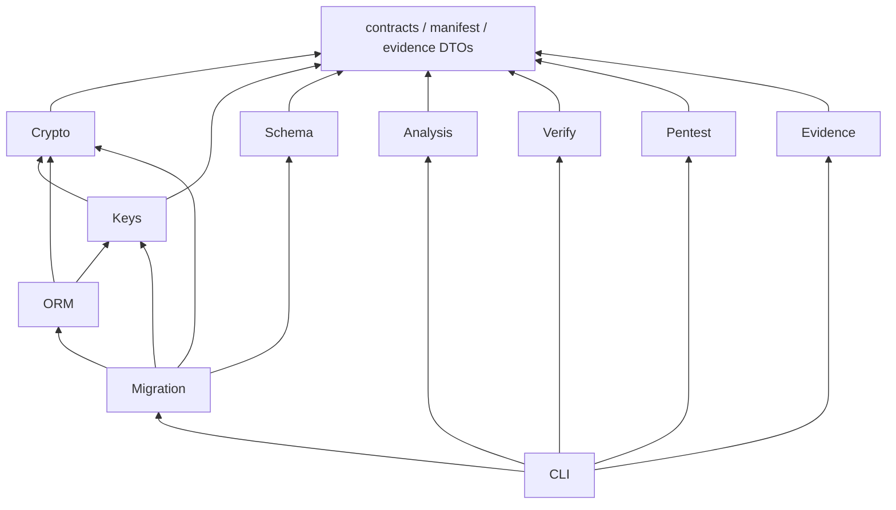

# Manifest, identity, and public contracts

Status: specified design with initial manifest JSON, field-format, and inspection support.
Most interfaces remain proposed. Reviewed: 2026-10-04. Handoff reconciliation: 2026-10-05.

This document defines manifest semantics, identity provenance, shared versions and errors,
public APIs, CLI commands, configuration, and module contracts. The [blueprint](README.md)
assigns detailed subsystem contracts to their owners.

## Terms and maturity

| Term | Exact meaning |
|---|---|
| Protection Manifest | Immutable, versioned policy document in desired or active history. Its presence alone supplies no runtime authority |
| DeclaredPolicy | Human-authored desired behavior. Editing or removing it never activates, deprotects, or drops stored data |
| PolicyLock | Generated public IDs, canonical desired manifest, compiler/catalogue pins, and immutable history links. Reviewable and committed without secrets |
| ActiveState | Authenticated environment state outside the protected database restore domain. Defines active head, readable formats, one write format, schema generation, lifecycle epochs, and current operation |
| TransitionPlan / TransitionRecord / TransitionReceipt | Immutable target-bound proposal / durable execution, checkpoints and approvals / bounded observations and residual obligations |
| representation_id | Random never-reused identity of one protected incarnation, distinct from a stable logical field ID |
| protection_domain_id | Environment/recovery-realm identity supplied by trusted deployment authority, never by a row or request |
| Protected field | Stable logical ID with declared authenticated payload/context and optional search representations |
| Logical value / physical representation | Typed application value / persisted envelope, identity, and declared companion structures |
| Envelope | Versioned payload framing with size bounds. Authentication requires an authorized key and context |
| Capability / index domain | Declared operator/construction contract / authorized key and normalization correlation scope |
| Protection Graph | Derived observations and unknowns, with recorded provenance. It has no policy authority |
| Key cache / provider | Bounded key material with separate leased authority / registered external custody adapter that preserves service semantics |
| Shred | Destructive lifecycle request with explicit scope. Managed denial and recovery-path conclusions are stated separately |
| Transparent | Ordinary Python value inside an enumerated ORM path. Applications and serializers receive plaintext |
| Controlled access | Opaque value that requires a release grant bound to purpose and principal. A local wrapper alone guards against accidents |
| Supported path | Released exact version/operation/loader/context cell with compatibility evidence and maintenance commitment |
| Coverage gap | Unsupported, unknown, detected-only or unobservable path excluded from the protection claim |
| Production profile | Approved construction, library, and deployment policy. Proposed policy does not establish support |
| Research profile | Isolated attributed experiment with threat/leakage model, oracle and exit gate |
| Educational implementation | Known technique independently implemented for learning. It never enables production use implicitly |
| Verified capability | Named property on pinned scope with successful controls and reproducible evidence |
| Tenant / subject / record | Authorized isolation domain / lifecycle owner / immutable payload-row identity |
| Generation / epoch / lease / fence | Key-material version / authorization revision / bounded operation authority / stale-operation rejection token |
| Tombstone | External durable denial that supported release and restore paths check. It does not destroy backed-up bytes |
| Evidence / collector | Provenanced observation / registered scoped observer with health and interval boundaries |

Maturity applies to each capability. The [checklist](../backend-build-checklist.md) records
current state. The ladder is cumulative:

| Level | Required basis |
|---|---|
| IDEA | A question |
| RESEARCHED | Primary-source alternatives |
| SPECIFIED | Interfaces, failures, and an acceptance gate |
| PROTOTYPED | A disposable executable artifact |
| IMPLEMENTED | A maintained artifact |
| TESTED | Pinned controls and mutants |
| MEASURED | Raw benchmark results |
| REVIEWED | An identified independent reviewer and resolved findings |
| PRODUCTION_CANDIDATE | Required correctness, lifecycle, migration, safety, and review gates |
| SUPPORTED | Released exact compatibility cells, upgrade and deprecation policy, and maintenance commitment |

A documentation pass establishes at most SPECIFIED. Research intent is a separate axis. A
verified property names its evidence and scope. It does not advance unrelated capabilities.

Abbreviations used across these contracts include:

| Abbreviation | Meaning |
|---|---|
| AAD | Additional authenticated data |
| AEAD | Authenticated encryption with associated data |
| AST | Abstract syntax tree |
| CAS | Compare-and-swap |
| CFG | Control-flow graph |
| CLI | Command-line interface |
| DAST | Dynamic application security testing |
| DB | Database |
| DDL / DML | Data definition language / data manipulation language |
| DTO | Data transfer object |
| ETL | Extract, transform, load |
| IAM | Identity and access management |
| IR | Intermediate representation |
| JCS | JSON Canonicalization Scheme |
| JWT | JSON Web Token |
| KDF / KEK / KMS | Key derivation function / key-encryption key / key management service |
| ORM | Object-relational mapping |
| PCAP | Packet capture |
| PK | Primary key |
| RPC | Remote procedure call |
| SAST | Static application security testing |
| SDK | Software development kit |
| TLS / TTL / UUID | Transport Layer Security / time to live / universally unique identifier |

[RFC 5116](https://www.rfc-editor.org/rfc/rfc5116) also calls AAD associated data. The contracts
use AAD for context authenticated with the ciphertext, including identity and format bindings.

## Desired policy and active authority

The authority sequence is `DeclaredPolicy → PolicyLock → external ActiveState → TransitionRecord`.
The lock supplies a proposed target. Only a verified transition and authenticated CAS can change the active head.
The record tracks that reconciliation. It cannot bypass current authority.

The compiler generates model, table, field, and representation UUIDs into `cryptalis.lock`.
Safe renames preserve logical IDs through an explicit reviewed identity mapping.
Names alone never establish continuity. Ambiguous rename/delete/re-add diffs reject.
Deprotecting and later reprotecting a field always creates a new `representation_id`, even with identical options.
History retains retired IDs. No retired representation or physical slot recycles.

Deployment authority supplies `protection_domain_id`. It is separate from portable desired policy.
Plans, active records, grants, recovery records, and crypto bindings bind that domain.
Staging clones cannot silently inherit production authority or roots.
Deliberate DR sharing requires a reviewed recovery plan. The exact procedure remains [Q7](README.md#unresolved-research-questions).

ActiveState requires an authenticated current head, monotonic revision, CAS, durable idempotency, and independent backup/recovery.
It retains accepted read descriptors, exactly one write tuple/version, schema generation, denial/retirement epochs, and overlapping-operation identity.
The production backend remains Q1. A local development file adapter supplies no production rollback-resistance claim.
Restored database checkpoints cannot become the current head or reduce epochs.
Unavailable or unauthenticated authority denies admission under the declared availability contract.

Startup admits only an exact binary/catalogue/schema/format compatibility tuple for current ActiveState.
Session writes recheck that authority. Desired-before-schema and schema-before-desired deployments cannot select new semantics.
An inactive desired diff can coexist only when the existing active mapping remains fully admitted.
Removing required active declarations or descriptor history rejects startup until an explicit transition resolves the dependency.

### Total semantic diff contract

The compiler compares authenticated active policy with the generated desired lock and immutable history.
For every valid pair, it emits one ordered plan or an actionable unsupported decomposition.
It never ignores an unknown semantic member or guesses a rename, key, domain, or format.
Invalid or ambiguous inputs return Manifest.Invalid before classification.

| Diff outcome | Required consequence |
|---|---|
| No semantic change | No transition or data rewrite. Report already active |
| Descriptions/source locators or proven physical rename | Preserve logical/representation bindings. Reviewed metadata/DDL only. No incidental re-encryption |
| Authorization-only change | Reconcile current policy/epoch without payload rewrite when compatible. Tightened authority also applies to old descriptors |
| Unprotected to protected | PROTECT with a new representation and reviewed schema/data plan |
| Protected payload/identity/codec/null/access binding change | RECONFIGURE_PAYLOAD, explicit compatible read mapping or re-encryption. No reinterpretation of old bytes |
| Search capability/domain/normalizer/generation change | REINDEX or explicit term retirement. Reject while search is unsupported |
| Protected to unprotected or declaration removal | DEPROTECT proposal. Preserve active dependency until verified, approved plaintext switch. Never DROP by compiler |
| Key wrapper or existing payload-key change | KEY_REWRAP or KEY_REENCRYPT from an explicit lifecycle request. Alias movement is not an inferred policy change |
| Format/binary compatibility change | UPGRADE_FORMAT or metadata admission after compatibility checks. Retirement needs a separate irreversible action |
| Restore or complete exit request | RESTORE_ADMISSION or DECOMMISSION from explicit operator intent. Never infer from snapshot or package removal |
| Compound compatible changes | One deterministic ordered plan with dependencies, a single active scope, and explicit irreversible boundaries |
| Unsupported, conflicting, or unknown combination | Reject with a safe decomposition and blocked capability. No partial implicit activation |

The [ORM owner](orm-schema-migration.md#migration-state-machine-and-concurrency) defines phase execution.
The [crypto owner](crypto-search-lifecycle.md#key-operation-contract) defines distinct key effects.
Property tests must cover totality, deterministic ordering, remove/re-add, rename, clone, and unsupported combinations.

### Plan, record, approval, and receipt schema

All records use the restricted canonical encoding and explicit schema/producer versions.
Unknown required fields reject. Public IDs and aggregate estimates remain access-controlled operational metadata.

| Artifact | Required fields and safety conditions |
|---|---|
| TransitionPlan | Plan/operation IDs, kind and ordered work, digest, strategy=offline, creation/expiry, target identity, protection domain, source active revision/head, desired digest, schema fingerprint/generation, exact binary/catalogue/provider references, writer inventory, budgets, preconditions, recovery and last reversible point |
| TransitionRecord | Plan digest and exact target/scope, monotonic revision, observed generations, overlap-lock ownership, durable idempotency key, completed/attempted phases, per-row/chunk and DDL checkpoint references, retry class, approvals, evidence, finalizer and residual obligations |
| IrreversibleApproval | Exact plan digest, target identity/domain, enumerated actions and lost recovery paths, approver identity/authority, issue/expiry, observed preconditions, durable one-use disposition. Replays cannot authorize a different action |
| TransitionReceipt | Plan/target/source/target-active identities, exact binary/catalogue/schema/provider pins, completed phases, verification coverage, action and approval references, recovery obligations, excluded copies, limitations, observation time and evidence basis |

Target identity must distinguish replacement at the same endpoint. Its concrete PostgreSQL source remains Q5.
No hostname, database name, database OID, or editable JSON claim alone supplies that proof.
Apply acquires the overlap lock and re-inspects every safety precondition before mutation and immediately before SWITCH/finalization.
Unexpected changes to data coverage, schema, writers, provider state, target, authority, catalogue, or expiry invalidate the plan.
Expected effects must match the plan and its durable checkpoints before the next phase can proceed.
Reconciliation never treats the executor's own planned effects as permission to accept unrelated drift.
The executor never edits a stale plan to force progress. It reports a fresh-plan or repair action.

Plans and records contain no plaintext, sample values, deterministic value hashes, search terms, key bytes, credentials, or raw exceptions.
Internal cursors stay in authorized storage. Exports follow redaction policy.
No plan alone activates policy. No approval alone proves postconditions.
Separate approval occurs only at irreversible boundaries.
DEPROTECT requires approval before its first persisted plaintext, including staging before SWITCH.
The plan binds plaintext storage, resulting WAL/replica/backup exposure, and publication actions to their approval scopes.
Unchanged application grants do not make plaintext persistence reversible.
The [ORM execution contract](orm-schema-migration.md#deprotect-decommission-and-finalization) defines these boundaries and failure obligations.
Ordinary inspection, planning, reversible preparation, and retry do not add repeated approval prompts.

## Manifest semantics

The compiler turns DeclaredPolicy into a generated PolicyLock and immutable desired ManifestDocument offline. It takes
declarations, mapped metadata, an explicit version catalogue, and a compiler version. It returns
a canonical document, digest, diagnostics, and a map between logical and physical
representations.

Runtime observations cannot add capabilities. The manifest contains no secrets, personal values,
key bytes, credentials, or mutable worker or provider state.

Canonical bytes use UTF-8 RFC 8785 JCS and ASCII property names. Duplicate keys, lone
surrogates, NaN, floats, and unknown semantic fields are forbidden. Counters are integers in
0..2^53-1. Larger application integers use typed decimal strings.

Stable IDs are lowercase UUIDs. Bytes use unpadded base64url. Digests use lowercase,
64-character SHA-256 hexadecimal strings. Set arrays sort by stable ID or ASCII enum and reject
duplicates. Ordered arrays retain order. Strings retain their values without implicit Unicode
normalization.

Optional absence differs from explicit null. Null is permitted only where declared. The manifest
digest is SHA-256 over this sequence:

1. The ASCII label `cryptalis-manifest-v1`
2. One zero byte
3. Canonical document bytes, excluding the detached digest and signature

Hash equality does not establish signature authenticity. RFC 8785 is informational.

Initial `digest_manifest_json` support implements the exact domain prefix and lowercase
hexadecimal result. It hashes every supplied member. The caller must keep a detached digest or
signature outside the supplied object. The helper does not establish complete semantic validity.

The parser enforces these limits:

- Document size: <=16 MiB
- Nesting depth: <=32
- Fields: <=10,000
- Capabilities per field: <=64
- Identifier size: <=128 UTF-8 bytes

Exceeding a limit raises ManifestInvalid. The parser rejects unknown critical extensions. Schema
v1 has no executable extensions. Changes require schema and catalogue compatibility review.
G-MANIFEST still requires canonical vectors across languages and fuzz evidence.

Initial `decode_manifest_header` support validates the four required identity-header
representations for schema version 1. Revision numbering starts at 0. Revision 0 is the genesis
revision and requires `parent_digest: null`. Each later revision requires a canonical parent
digest. This local rule does not prove parent existence, digest agreement, or complete ancestry.
The decoder does not validate the remaining schema or catalogue references.

Initial `validate_manifest_parent_link(raw, parent_raw)` support checks one supplied pair and
returns the child header. Both documents must have valid identity headers and the same manifest
ID. The child revision must exceed the parent revision. Revisions can skip counter values.
The child's `parent_digest` must match the domain-separated digest of
the canonical parent document. Failure raises `ManifestInvalid` without input values.

The check proves consistency between two supplied documents. It does not authenticate either
document, validate complete ancestry, or establish the current authorized policy. Both files
can come from an attacker. Signatures and a trusted history authority remain pending.

Initial `validate_manifest_history(raw_documents)` support checks one complete, ordered
genesis-to-head sequence. The input must be a nonempty tuple of immutable byte strings. The
first document must be revision 0. Each later document must keep the manifest ID, increase the
revision, and name the canonical digest of the preceding document. Revision numbers can skip.
The helper accepts at most 4,096 documents and 16 MiB for the complete input. It checks these
aggregate limits before it parses a document.

The helper returns the validated head header. It does not validate the complete semantic
schema, authenticate the documents, select an authorized head, detect an omitted later revision,
or supply runtime authority. An attacker can construct a different internally consistent chain.
Q1 and G-ACTIVE still own trusted history and current-head selection.

R means required after compilation. C means required when the capability is selected. O means an
annotation. All referenced enums and policies resolve in the pinned catalogue. Compilation
rejects missing required fields, ambiguity, unresolved references, and incompatible profiles.
The defaults below are explicit. The compiler never guesses them.

Each field uses the canonical encoding rules above.

| Field / scope | Need and representation | Version/change consequence |
|---|---|---|
| schema_version, manifest_id, revision, parent_digest | R integer, UUID, monotonic integer, digest/null at genesis | Compatible parser; never overwrite old revision |
| compiler_version, catalogue_digest | R exact release + digest | Recompile/diff; changed semantics require migration |
| models: model_id, table_id, module/qualified_name, database_schema/table_name | R stable IDs + locator strings | Name change preserves IDs; ownership move reviewed |
| fields: field_id, representation_id, attribute, python_codec, original_sql_type | R generated logical/incarnation UUIDs, name, codec/version, dialect/type/parameters | Safe rename retains IDs. Re-adoption uses a new representation. Codec/type changes require migration |
| tenant_locator, subject_locator, record_locator | R typed attribute locator + derivation-policy ID/version | Identity changes require authorized re-encryption |
| provenance_policy | R issuer/adapter IDs and versions, principal/workload classes, actions/purposes, grant lifetime | Widening security-reviewed, tightening deployment-gated |
| access_mode, protection_profile, classification | R transparent/controlled; catalogue IDs/enums | Consumer, serialization and release-policy review |
| suite_id, envelope_version, kdf_domain_version | R numeric catalogue IDs | New writes plus explicit old readable formats |
| normalization | R type codec/version, Unicode/case/whitespace policy | Search reindex; payload preserves original value |
| null_policy | R sql_null/encrypted_null + uniqueness rule | Schema/query/index migration; null differs from empty |
| capabilities | R array (empty=no search); operator/construction/version/domain/leakage acceptance/limits | Addition requires query/leakage/cost/lifecycle review |
| equality, uniqueness, join_domain | C capability ID; scope/null policy; shared-domain UUID/participants | Disabled initially. Offline reindex first. Online dual-index support requires separate evidence |
| range, text_prefix, structured | C construction/version, operator subset, token budget, candidate verification/path policy | Research catalogue until individual gates pass |
| physical_mapping | R columns/tables/types/length/null/index/constraint specs + naming version + nonrecycled uint32 storage/term slots | Collision rejects; reviewed schema diff |
| key_scope, key_policy, cache_policy, lifecycle_policy | R scope/provider IDs/purposes; TTL/lease/capacity/offline; restore/shred policy | Provider state external; safety review on changes |
| migration_policy, previous_readable_formats, compatibility_requirements | R protocol versions, suite/envelope/codec/index tuples, version catalogue digest | Old-reader removal needs evidence/approval |
| migration_binding | C migration ID/source/target digests + admitted state set | Actual phase/cursor belongs to checkpoint, not policy mutation |
| registered_writers, supported_query_paths, evidence_collectors | R policy/compatibility/collector ID arrays | Empty means no declared coverage; observation never registers |
| retention, shred_behavior, search_residue_behavior | R policy IDs, resources/exclusions, searchable/strict_shred profile | Technical assertion excludes legal erasure and unmanaged copies |
| description, source_locations | O text and source revision/path/span | Revision/digest changes; no automatic payload re-encryption |

### Immutable field-format descriptor

The next admitted payload descriptor must bind `representation_id` alongside model, table, and field IDs.
Its immutable digest, catalogue entry, and AAD/KDF version must distinguish it from the current structural schema.
The environment `protection_domain_id` is trusted deployment authority and a crypto binding, not a mutable physical locator.
Exact successor bytes, version identifiers, and suite composition remain Q2/C34 review gates.
Do not emit real ciphertext or reinterpret schema 1 under the new contract.

### Implemented structural descriptor schema 1

The following fourteen-member schema describes the existing helpers exactly.
It lacks `representation_id` and is not the future admitted production descriptor.
Current fixtures, hashes, and helpers remain unchanged during this documentation pass.

A descriptor is a separate immutable JCS object. It permits no extensions or annotations. Every
property below is required:

| Property | Representation |
|---|---|
| `descriptor_schema` | Integer 1 |
| `model_id`, `table_id`, `field_id` | Lowercase UUIDs |
| `access_mode` | `transparent` or `controlled` |
| `suite_id`, `envelope_version` | Catalogue integers |
| `kdf_domain_version`, `aad_binding_version` | Catalogue integers |
| `codec_entry_id`, `codec_version` | Catalogue integers |
| `codec_parameters` | Object validated by the exact codec's schema. Empty when parameterless |
| `null_policy` | `sql_null` or `encrypted_null` |
| `identity_encoding_version` | Integer 1 for UUID identity bytes |

Numeric IDs are 1..65535, except descriptor and identity versions. The selected format catalogue
adds narrower constraints. F1 suite and envelope selectors fit u8. Only its enumerated candidate
values are valid. The generic range cannot admit an unknown suite, unknown format, or overflow
of a narrower field.

Initial [`canonicalize_field_format_json`](../../src/cryptalis/manifest/descriptor.py) support
checks structure and returns restricted RFC 8785 bytes.
`digest_field_format_json` computes the creation-policy digest defined below.
The helpers require exactly the fourteen descriptor members, canonical UUIDs, declared enums,
and numeric ranges. Both schema versions must be the integer 1.
Boolean values cannot substitute for integer IDs. Codec parameters must be an object.
The bounded JSON rules apply to the entire descriptor.
Missing members, extra members, and malformed values raise `ManifestInvalid` without input values.

These helpers do not resolve catalogue entries or approve codec parameter semantics.
An in-range ID can remain unknown, incompatible, or too large for a selected envelope format.
Runtime admission still requires the exact catalogue and its narrower constraints before key release.
The helpers do not authenticate a descriptor, select a provider, import a codec, or encrypt data.
The [example descriptor](../../examples/field-formats/parameterless.json) is a synthetic
structural vector. Its numeric IDs do not identify approved production algorithms.

The catalogue binds one immutable codec entry ID to a codec/version pair. Reusing an ID with
different bytes is forbidden. `codec_parameters` can constrain decimal scale/range, never supply
runtime values or executable code.

The creation-policy digest is SHA-256 over ASCII `cryptalis-field-format-v1`, one zero byte, and
the restricted JCS bytes of exactly this object. Its stable IDs bind the logical field.

The digest excludes search normalization and constructions, physical names, descriptions and
source locations, writer and collector lists, current grants and epochs, and cache leases. It
also excludes provider endpoints and the whole-manifest revision. These members do not redefine
payload encoding or AAD.

Changing an included member creates a new digest. The change requires an explicitly approved
readable tuple or a re-encryption migration. Search-policy changes require their own
representation migration. Tightened current authorization still applies to old data.

Store exact descriptor bytes and their catalogue interpretation in immutable manifest history,
keyed by digest. ActiveState selects an authenticated active manifest that lists accepted creation digests in
`previous_readable_formats`. It also lists the corresponding suite, envelope, codec, KDF, and
AAD tuples.

A header-selected digest is only a lookup hint until authorization and authentication succeed.
An unknown, altered, unlisted, or incompatible descriptor fails before key release. A descriptor
cannot cause dynamic imports, trial keys, or provider selection.

Never replace the creation-policy digest with the current whole-manifest digest. Adding an
unrelated field must not strand ciphertext. The full manifest digest still binds grants, plans,
and evidence. [Crypto contracts](crypto-search-lifecycle.md) define exact payload and envelope
bytes.

Validate current ActiveState, its authenticated manifest, schema, and catalogue at session creation, query, flush, key
authorization, and migration transitions. Drift fails closed. G-MANIFEST covers exact
descriptor/hash vectors, unrelated annotation changes, revoked old descriptors and unknown
codec/parameter substitutions.

A valid synthetic manifest fixture must contain every R/C record above; abbreviated declaration
snippets are not deployable manifests. G-MANIFEST must produce independently checked fixture
bytes.

## Trusted context provenance

The host owns authentication and business authorization. Cryptalis consumes explicit attestation
of those decisions. Correct encryption does not establish authorization. A trusted adapter is
configured application code. A request cannot select its import.

The host adapter must validate token authority in this order:

1. Validate the issuer, audience, algorithm, and key.
2. Validate expiry and purpose.
3. Validate current tenant membership and action policy.

If the host uses JWTs, apply RFC 8725 checks for token confusion, algorithm, and audience. An
authenticated principal still requires authorization for the selected tenant, subject, resource,
action, and purpose.

An immutable ProtectionGrant binds its ID and issuer/version to a principal and authentication
basis, workload, selected tenant, and subject-derivation rule/version. It also binds operations
and purposes, active manifest digest, protection domain, current external authority revision, allowed key and index generations, epoch, issue and expiry times,
request or job ID, audience, and optional resource set. It contains no plaintext or keys.

A trusted in-process adapter creates an opaque authorized handle. Exported and job grants are
signed and audience-bound. They require fresh policy and epoch checks. Python constructors and
signatures cannot constrain malicious code inside the trusted process. That threat remains
outside the core guarantee.

| Identity | Authority | Required relationship |
|---|---|---|
| Principal | Host authentication adapter | Validated session/token/workload; raw headers insufficient |
| Authorization scope | Host policy adapter/service | Explicit principal permissions for tenant/resource/action/purpose |
| Tenant | Grant issuer after membership check | Exactly one authorized selected tenant per ordinary session |
| Subject | Authorized persisted ownership or creation policy | Data owner can differ from principal; tenant binding mandatory |
| Record | Creation allocator / immutable persisted UUID | Exists before encryption; mutable/request-selected PK insufficient |
| Request | Trusted middleware | Correlation only, grants no authority |
| Workload/provider | Workload IAM + provider registry | Separate credential; arbitrary envelope key locator rejected |
| Job | Trusted enqueue service + authenticated worker | Bounded signed intention, expiry/replay policy, current authorization |

A FastAPI middleware or dependency must use this order:

1. Authenticate the principal.
2. Authorize the requested scope.
3. Construct the grant.
4. Open the session.
5. Close the session in finally, including after success, error, or cancellation.

A tenant ID in a request body, path, or header requests a selection. It does not establish
authority. Compare that ID with authorized membership. Resolve the row and subject within the
selected tenant with a parameterized, scoped query.

Database metadata is not an integrity authority. Authenticated ownership and AAD must agree. New
rows use the declared, authorized creation policy. Legacy rows require an independently reviewed
ownership source. Ambiguous legacy ownership blocks backfill before key lookup.

Creation allocates a random immutable record UUID and authorizes or derives the subject. Flush
rejects identity mutations. Reads apply tenant filtering before identity-map reuse. They
validate the subject, record, and field before release.

Subject-scoped grants reject other subjects. Authorized tenant-wide grants resolve rows by the
declared ownership rule. PKs remain relational IDs. The record UUID prevents confusion with
mutable or namespaced PKs. A tenant or subject transfer requires explicitly authorized
decryption and re-encryption through a migration. Editing an ID is insufficient.

A session cannot switch tenant or manifest authority. Administration uses separate batches. The
identity-map mechanism must pass G-ORM, whether it uses a tenant strategy or globally unique
UUIDs with compulsory scoping. Context alone does not solve identity-map isolation. Pooled
connection state never establishes authorization authority.

### Requested resource binding

Point loads, refreshes and identity-map reuse require `ResourceBinding`: issuer/version, tenant,
table ID, immutable expected record UUID, canonical relational-locator digest, allowed subject
or ownership rule, purpose/action, manifest digest and expiry. The host authorization adapter
issues it only after verifying an authenticated resource mapping or a creation receipt.
Requested PKs and all ownership/record columns from the same mutable database row cannot attest
their own correctness. The default mapping authority is a host-managed authenticated registry
independent of application DB restore, not a new Cryptalis authentication service. The host may
instead authorize immutable record UUIDs directly as resource identifiers. Both alternatives
must pass G-CONTEXT before support.

For composite locators, the host's pinned codec encodes ordered column-ID/typed-value pairs with
restricted JCS. The locator digest is SHA-256 over ASCII `cryptalis-resource-locator-v1`, one
zero byte, and those bytes. This digest is not a searchable representation.

Creation allocates the UUID first. It authorizes the tenant and subject, then registers the
binding as pending. The host activates the receipt only after confirmed persistence. It
reconciles an ambiguous commit by UUID and denies pending or orphan mappings.

Changing a locator requires an authorized mapping transition. Changing tenant or subject also
requires re-encryption. Mapping outage or ambiguous legacy ownership raises Context.Unavailable
or Context.Conflicting, respectively.

Compare the trusted expected UUID, tenant, field and authorized subject against
parsed/authenticated row context before release, including cached/relationship loads. Replacing
ciphertext plus every key/subject/record companion while retaining the requested PK must fail.
No trusted binding means point-load release is rejected, not guessed from relational metadata.
Host mapping correctness is an explicit trust assumption; cryptography cannot fix a dishonest
host authorization adapter.

Tenant-wide discovery queries may release only individually authorized authenticated rows and
must verify declared search predicates after decryption. This establishes field/identity
self-consistency, not malicious-DB completeness, relational-locator integrity or freshness.
Omission, reordering and same-identity replay remain outside this query profile. Consumers
requiring exact requested-resource membership use the point-binding profile; broad grants do not
silently imply that stronger guarantee.

ContextVar transports a handle. Each protected operation validates it. Task creation must clear
authority or deliberately derive a narrower grant. Copied context does not establish authority.
Detached decryption requires explicit valid context. Expiry invalidates operation handles,
although bounded cache bytes can remain.

Background and service accounts use separate workload grants instead of serialized tenant IDs.
Recheck membership and epoch at job start, resource acquisition, and the commit fence.
Migration, maintenance, and restore require separate IAM identities, approved transitions, and
short-lived tenant batches. Web principals cannot get these grant classes. The production
catalogue excludes the synthetic test issuer.

Missing, conflicting, expired, unauthorized, or unavailable provenance fails before provider
load or protected SQL. Authorized two-phase reads can fetch bounded hidden ciphertext before
warming subject material. They cannot bypass grant or resource validation or release plaintext
before authentication. A policy timeout raises ContextUnavailable and denies the operation. No
zeroization claim covers Python values.

## Public Python surface

The normal proposed surface supplies one declaration and one trusted Session identity.
Exact SQLAlchemy syntax remains Q3, not a shipped API.
Imports cause no network I/O, schema mutation, migration, or activation.

```python
class Customer(Base):
    email: Mapped[str] = protected_column(String)

with cryptalis.session(Session, identity=request_identity) as db:
    customer = db.get(Customer, customer_id)
```

The host adapter authenticates request/job identity and derives grants internally.
Ordinary callers never supply keysets, nonces, AAD, raw keys, generations, or cache leases.
Normal mapped operations use current ActiveState, not the newest declaration.
The initial runtime is synchronous and no-search. Async and controlled release require their own admitted cells.
If public SQLAlchemy hooks fail the coverage experiment, expose an explicit repository boundary instead of private hooks.

| Surface | Contract / I/O / failures |
|---|---|
| Normal `protected_column`, `cryptalis.session` | Declare desired fields and bind trusted identity once. Session admission, execute/load/refresh/flush/commit expose any bounded authority or preparation wait. Typed denial/cold/unavailable errors |
| Internal compiler and schema planner | Deterministic PolicyLock/history/diff/plan output. No schema mutation or secret material |
| Internal `authorize`, `warm/awarm` | Validate grants, reserve bounded quota, and prepare exact material at explicit operation boundaries. Scalar hooks stay local and cannot refill quota |
| Advanced provider registration | Startup configuration for one admitted provider/profile. No arbitrary header-selected adapter or hidden imports |
| Advanced controlled `reveal/areveal` | Separate profile with independent release authority where claimed. Not routine transparent-field access |
| Internal `request_lifecycle` and transition stepping | Compose target-bound generic plans, durable idempotency, native states, and finalizers. No independent activation protocol |

No generic public `encrypt`, `decrypt`, caller-supplied AAD/key, plaintext fallback, or skip/bypass API belongs to the normal runtime package.
Maintenance codecs require a separate short-lived operator identity and an authorized target-bound plan.
Separate approval is required only at its irreversible boundaries.
Process compromise remains outside the core guarantee.

Material possession, operation authority, and usage quota are separate checks.
Cached material supplies neither current output permission nor new quota.
Authority outage denies new admission. Unresolved output/commit remains pending until reconciled handoff or abort.
The [crypto cache contract](crypto-search-lifecycle.md#initial-single-process-cache-and-authority) owns the initial bounds.
The [ORM owner](orm-schema-migration.md) owns loader/flush/rollback state and explicit hidden-row batching.
No unknown-subject query introduces remote work in a scalar hook.

The normal flow is declare, check, migrate, status.
Search, incident response, controlled release, restore admission, and destructive finalization remain explicit advanced tasks.
Stable IDs, phase names, key mechanics, retry tokens, and checkpoint details stay in generated records and advanced diagnostics.

## CLI and configuration

The proposed CLI uses these shared exit codes:

| Code | Meaning |
|---|---|
| 0 | All requested applicable checks PASS, or a read-only proposal is emitted with no blocking diagnostic |
| 1 | FAIL |
| 2 | Invalid input, configuration, or authorization |
| 3 | WARNING, INCONCLUSIVE, or incomplete coverage |
| 4 | Operationally unavailable or cancelled |
| 5 | Only NOT_APPLICABLE or NOT_RUN |

Plans record kind=proposal. They never record security PASS. Combined results use precedence
2,4,1,3,5,0. Machine JSON preserves each result dimension.

| Command | Inputs -> outputs | Defaults/network/authorization |
|---|---|---|
| init | Project config + generated cryptalis.lock/history | Proposed, offline, no secrets or runtime activation |
| check / check --ci | Desired/active compatibility and selected preflight findings | Proposed, offline default. --live requires scoped read-only credentials. Missing live evidence remains unknown |
| migrate | Fresh plan + safe execution/resume summary | Proposed offline maintenance strategy. Shows target, rows, storage/time uncertainty, rollback point, and pending irreversible actions. Revalidates before mutation |
| status | Desired/active drift, progress, finalizer and recovery obligations | Proposed read-only. Says declared but inactive or cleanup requires approval |
| plan --out PATH / apply PATH | Target-bound generic transition proposal / reinspection and execution | Advanced, proposed. Plan is non-sensitive, expiring, and immutable. Apply never trusts editable JSON or skips preconditions |
| resume / finalize | Existing operation ID / pending progress or exact irreversible actions | Advanced, proposed. Resume reconciles actual effects. Finalize requires separately bound approval and current evidence |
| restore check / restore admit | Quarantined target + recovery manifest / admission report or transition | Advanced, proposed. Check uses read-only authority. Admit reconciles current external policy/denial before production credentials |
| upgrade check | Exact binary/catalogue/schema/format matrix -> safe ordering/refusal | Proposed read-only. One active writer version. Downgrade never converts or destroys data automatically |
| remove | Aggregate field deprotection + DB/binary/job/key/recovery inventory | Proposed guided decommission plan. Package uninstall last. Separate plaintext and retirement approvals |
| keys rotate | Configured exact scope/profile -> layer changed + remaining old reads | Proposed. No old-path destruction. Revocation, destruction, and incident response are separate advanced plans |
| doctor; schema explain | Source/snapshot findings or physical/leakage/version facts | Advanced optional read-only analysis. No arbitrary app import or implicit live credentials |
| verify; pentest | Pinned fixtures/collectors or authorized synthetic lab -> bounded evidence | Advanced optional. Verify works without DAST. No implicit production destructive action |
| evidence inspect/validate/export | Bundle + trust policy -> scoped findings/rendering | Offline default. No implicit upload or signing authority |
| manifest inspect | Local child + optional --parent PATH -> identity header/digest | **Implemented narrow slice**, offline read-only regular files. Header or one supplied pair only |

`plan` owns transition proposals. Optional minimum-leakage analysis returns a distinct PlanProposal and never activates it.
`migrate plan` is a superseded proposed spelling, not an implemented command.
No proposed command above is available merely because its contract exists.
The [checklist](../backend-build-checklist.md) owns command maturity.

`migrate` creates a fresh plan and resumes through the internal engine after exact operation reconciliation.
It reports maintenance requirements before work and one actionable next step after failure or a pending boundary.
DEPROTECT pauses before the first persisted plaintext and any publication outside its approved scope.
The same exact approval can cover staging and SWITCH when it explicitly names both actions.
Normal rotation reports whether wrappers, new writes, or existing payloads changed and which old material remains needed.
Saved plans and approval artifacts use the schema above.

The initial `manifest inspect` command reads bounded local regular files. It emits the validated
identity header and computed digest as text or JSON. With `--parent PATH`, it checks one parent
link and reports `scope: manifest_parent_link` only after all checks pass. Without `--parent`,
inspection retains `scope: manifest_header`.
Argument failures return code 2 with a redacted `CLI.InvalidArguments` record.
File input or authorization failures return code 2 with `Manifest.Invalid`.
Other file I/O and cleanup failures return code 4 with `Manifest.Unavailable`.
Neither mode changes manifest files or uses the network. The command does not complete C25 or establish full semantic validity.

Under the [failure policy](../../ENGINEERING_PLAYBOOK.md#fail-loudly-and-explicitly), machine mode requires a stable error object when stderr is available.
This includes argument validation. Validation failures do not write success output.

Result, help, and diagnostic output require a complete write and successful flush.
Output failures use `CLI.OutputUnavailable`, operational exit 4, and safe `output_role`, stage, and cause fields.
Stages are `output_write`, `output_flush`, `output_cleanup`, and `output_close`.
Missing or closed streams and short writes fail explicitly.
If stderr is unavailable, exit 4 is the remaining error channel. The command cannot supply a JSON diagnostic there.

A failed flush can follow partial or complete output bytes.
Consumers must require exit 0 and complete framing before accepting a result.
Successful flush proves local output handoff, not recipient processing or durable storage.
The terminal entry point redirects a failed native stream to the null sink to prevent another shutdown flush failure.
If that cleanup fails, it closes the native stream and preserves cleanup and primary failures in safe related diagnostics.
This bounded disposal never changes failure into success.
Native close can attempt another flush to the original destination. The original failure remains fatal.

Cleanup can redirect or close the standard output descriptor.
Treat `main()` as a terminal entry point, not a reusable library output API.
Custom host streams require caller-managed lifetime. Their arbitrary shutdown behavior is outside the tested native-stream guarantee.
Reject repeated input-identity or security-policy selectors unless their explicit contract defines an observable, tested precedence rule.

The inspector accepts full option names. Repeated `--parent` options reject before file reads, including identical values and `--parent=PATH` forms.
An exact `--json` token before the `--` terminator selects JSON error output even when argument parsing fails.
Tokens after `--` remain path values. They cannot select JSON mode.
The [dated audit](../documentation-claims-audit.md#cli-failure-corrections) records corrections to the initial CLI findings.

Declarations compile policy. Project configuration selects the digest, catalogue, provider IDs,
and output paths. Deployment configuration supplies endpoints, credential references, and
restrictions. Runtime context supplies grants. Lab authorization supplies targets and budgets.
It cannot widen production policy.

Presentation and operational settings use default -> project -> deployment -> CLI precedence.
Effective security policy is the intersection of the authenticated active manifest, deployment restrictions, current
grant, and lifecycle state. Conflicts reject the operation. CLI options and environment
variables cannot add search, bypass provenance, extend leases, or disable safety.

### SafeTelemetryProfile

Proposed runtime defaults disable SQLAlchemy echo and hide parameters.
Database parameter capture in OpenTelemetry is off. PostgreSQL statement/error/bind logging needs scoped inspection and reviewed configuration.
Generated repr, errors, traces, metric labels, and support diagnostics exclude protected values, raw terms, key bytes, and ciphertext bodies.
Safe diagnostics use allowlisted field aliases, format/version, operation/stage, redacted cause, and correlation ID.
Transparent Python values can still be deliberately logged or exported by host code.
The [assurance collector contract](assurance-evidence.md#minimal-read-only-preflight-evidence) reports observable settings and unknown sinks.
Canary sink evidence gates the claimed profile. No docs-only default claim implies implemented configuration.

Credential providers resolve secrets. Manifests and reports do not contain them. Evidence
includes a digest of the redacted effective configuration.

## Errors and observability

Stable errors contain a family and code, redacted public reason, retryable flag, and correlation
ID. Never interpolate values, tokens, keys, ciphertext, or request payloads into these errors.

The [playbook](../../ENGINEERING_PLAYBOOK.md#fail-loudly-and-explicitly) owns general failure, recovery, and diagnostic requirements.
Errors must also identify the operation and stage, with safe context such as the child/parent input role.
Use allowlisted fields and stable categories. Distinguish invalid input from operational unavailability under the CLI exit mapping.
Preserve causes internally when wrapping errors. Public redaction can suppress raw exception chains at the documented boundary.
Retain safe cause categories or controlled diagnostics because raw exceptions can contain secrets.
A correlation ID alone does not identify the failed stage or establish an observable diagnostic channel.

Inspection errors include `operation`, `stage`, `input_role`, and `cause`.
The `header` stage covers JSON decoding and identity-header validation. The `parent_link` stage covers one supplied pair.
Input roles are `child`, `parent`, `pair`, or null for arguments and output failures.
Causes are fixed validator categories or symbolic operating-system error names. `UnknownIoError` reports an absent or unrecognized OS error number.

Missing or unusable paths and permission denial return code 2. Other open, metadata, read, and close failures return code 4.
If cleanup also fails, `related_error` retains the primary safe diagnostic. Text output also shows its stage, role, and cause.

Wrapped exception causes remain internal. Public diagnostics exclude raw exception text, paths, input values, and traceback payloads.
All current inspection error records set `retryable: false`. The command does not rerun inspection or result writes.

| Family | Codes / retry behavior |
|---|---|
| CLI | InvalidArguments, OutputUnavailable. Correct arguments or the output destination. No automatic delivery retry |
| Manifest | Invalid, UnsupportedVersion, DigestMismatch, Unavailable. Reject invalid input or report operational unavailability |
| Context | Missing, Unauthorized, Expired, Conflicting, Unavailable; independently get fresh authority |
| Envelope | Malformed, UnsupportedFormat, AuthenticationFailed, Oversize; fail/quarantine, never NULL fallback |
| Key/provider/cache | Unavailable, Denied, Revoked, Shredded, StaleLease, GenerationMismatch, ColdMaterial, QuotaExhausted; bounded availability retry after authorization |
| Codec | InvalidType, InvalidValue, Oversize; input rejected before encryption/DML, never coercion or truncation |
| Execution | CommitAmbiguous; reconcile durable operation/record identity before replay |
| Query planning | UnsupportedEncryptedQuery, DomainMismatch, UnboundContext; pre-SQL failure, no scan/broader index |
| Query result | IndexInconsistent; detected after bounded fetch/authenticated decode; fail the whole buffered result with no partial logical release |
| Schema/migration | Drift, UnsupportedTransform, Conflict, UniquenessConflict, UniquenessCollision, Paused, RepairRequired, Irreversible; operator recovery |
| Transition | StalePlan, WrongTarget, ExpiredPlan, UnsupportedStrategy, ApprovalRequired, ApprovalInvalid, ActiveStateUnavailable; stop before mutation or irreversible boundary |
| Lifecycle | ScopeConflict, FenceLost, PendingExternal, RestoreDenied; resume idempotency record or deny |
| Analysis/evidence/safety | ParseGap, UnknownFlow, CollectorUnavailable, IntegrityFailure, TargetUnauthorized, BudgetExceeded; gap preserved |

Retry a provider or database outage only within the deadline and idempotency contract. Quota
exhaustion raises Key.QuotaExhausted before protected DML or output. Prepare quota explicitly. A
scalar hook never refills it.

If commit status is unknown, inspect durable identity before replay. Never replay silently.
Index inconsistency invalidates the result or statement. No affected write transaction commits.
The session requires rollback/closure before reuse under the ORM contract. The contract leaves
open whether IndexInconsistent requires rollback, session closure, or both.

Index inconsistency blocks cutover and records an evidence failure. Ordinary AEAD reads cannot
prove search completeness. Schema drift or an incompatible old application stops writes.
Analyzer uncertainty remains unknown. Collector failure makes related negative results
INCONCLUSIVE.

Allowed telemetry includes digests, versions, error codes, durations, provider and cache counts,
migration phases, lease ages, and coverage. Pseudonymous IDs have bounded cardinality. Telemetry
must exclude protected values, raw search tokens, keys, credentials, payloads, and ciphertext
bodies.

Transparent read diagnostics cannot create an undeclared synchronous network dependency.
Controlled access and lifecycle decisions obey their explicit durable audit policy.

## Packages and dependency direction

The responsibility names below define the proposed package structure. Initial manifest decoding,
canonical output, content digests, identity-header validation, parent-link and bounded
ancestry-chain validation, structural field-format digests, offline terminal inspection, private candidate F1/W1 framing,
and private scalar syntax encoding and decoding exist.
The [checklist](../backend-build-checklist.md) records implementation state. Shared immutable
contracts, including evidence DTOs, sit below adapters. Evidence orchestration and rendering sit
above adapters. The CLI composes use cases and defines no security semantics. No domain layer
imports a scanner or SDK.

| Module | Internal responsibility or admitted surface and allowed dependencies | Invariant/errors/test layer |
|---|---|---|
| contracts + manifest | IDs/versions/DTOs/parse/compile/diff; stdlib + reviewed codec only | Deterministic policy / Manifest / vectors+fuzz |
| crypto | envelope/AEAD/KDF/codec/search; contracts+reviewed crypto, no network/ORM | Authenticated release / Envelope / vectors+tamper |
| keys | provider/leased handles/lifecycle/tombstones; contracts+wrapping, no ORM/analysis | Scoped fence / Key / stateful chaos |
| sqlalchemy | mapping/descriptors/query/context; contracts+crypto+key interfaces+ORM | Logical/physical coherence / Query+Context / compatibility |
| schema | snapshots/physical compiler/drift; contracts+metadata adapter, no keys/DAST | Plan only / Schema / DB fixtures |
| alembic + migration | operations/checkpoints/backfill; schema+crypto+keys+ORM migration adapter | CAS/fence/recovery / Migration / crash+DDL |
| doctor + plan | IR/taint/rules/recommendations; contracts+read-only facts, no decrypt/policy mutation | Unknown preserved / Analysis / labeled corpus |
| verify | scenarios/oracles/collectors; contracts+explicit fixture adapters | Scoped controls / Evidence / mutants |
| pentest + network | lab scenarios/adapters/correlation; contracts+safety broker+evidence DTOs | Containment / Safety / scope-escape fixtures |
| evidence | validate/render/import/attest; contracts+interchange/signature libs, no implicit execution | Integrity distinct from truth / Evidence / parsing+redaction |
| cli + integrations | use-case composition/typed optional adapters; public interfaces only | Visible action/I/O / mapped errors / integration |
| experimental/lab distributions | Known constructions/scenarios; contracts+research adapters | Production cannot import / unsupported profile / differential |

Module responsibilities do not expose public crypto or lifecycle helpers.
The [normal API](#public-python-surface) defines visibility. Internal adapters consume crypto, keys, and transition interfaces.
The migration module hosts the shared engine. Lifecycle, restore, and exit handlers supply effects within its phases.

The private framing and scalar syntax experiments belong to the crypto module.
They are not admitted constructions or supported runtime APIs. No production consumer imports them.
The crypto owner defines [F1](crypto-search-lifecycle.md#32-parser-and-resource-limits),
[W1](crypto-search-lifecycle.md#35-local-secret-wrapping-candidate-w1), and
[scalar](crypto-search-lifecycle.md#implemented-scalar-syntax-boundary) boundaries and pending admission checks.



An arrow means the source depends on the target. Provider integrations implement the key
interface. The key core does not import every SDK. The search registry admits explicit
constructions instead of arbitrary code. Collector, provider, tool, and report interfaces allow
multiple credible implementations.

The native Doctor/rule API remains internal until two real pack implementations justify
stability. Signing identifies the publisher. It does not establish safe behavior. Untrusted
packs are restricted data, never Python imports.

## Version compatibility and research gates

Version manifest schema and instance separately. Also separate compiler, catalogue, envelope,
suite, KDF, codec, normalizer, representation, index domain, key generation, migration, rule,
scenario, and evidence schema versions.

Compatibility is an allowlisted tuple. A newer version is not automatically readable. Writes use
one ActiveState-selected tuple and one writer version. Reads accept only declared old tuples. Migrations bind source and target and
fence older writers. [ORM contracts](orm-schema-migration.md) define exact candidate and
supported runtime cells. Research ledgers record external versions.

| Gate | Question/default/alternatives | Experiment and pass/fail threshold | Safe work / blocked claims |
|---|---|---|---|
| G-MANIFEST | Restricted JCS semantic schema vs deterministic CBOR | Two language implementations, 10,000 generated manifests + malformed/limit/version cases; 100% byte/digest agreement and semantic diff classification; 0 accepted ambiguity; any divergence rejects freeze | DTO design safe; interoperability blocked |
| G-ACTIVE (Q1) | Select production authority versus development-only adapter | Authenticated head/history, forked ancestry, CAS race, duplicate idempotency, stale/DB/control restore, authority loss, wrong binary, abandoned finalizer. Zero rollback/implicit activation, independent recovery evidence and named review | DTO/local-dev design safe. Production backend and dependent runtime behavior blocked |
| G-PLAN | Total diff and non-sensitive target binding versus unsupported decomposition | Property-generated active/desired pairs, remove/re-add/clone, wrong target/expiry/tamper/replayed approval, drift at every boundary. Exactly one deterministic plan or explicit refusal, no sensitive artifact | Documentation safe. Apply/finalize behavior blocked until Q1/Q5 and P0 review |
| G-CONTEXT (P0) | One-tenant immutable grants vs separate release/repository boundary | Colliding tenant IDs; token/path/body/model/identity-map substitution, ciphertext plus all identity companions at fixed requested PK, mapping activation/ambiguous commit, inherited tasks, pool/cancellation, expired/restored jobs; 0 unauthorized provider loads/SQL/releases; all failures redacted; any bypass fails | Synthetic adapters safe; isolation/persistence claims blocked |
| G-API | Trusted Session identity with hidden preparation vs explicit repository/controlled batches | Five maintainers perform field/retrofit/query/incident/delete tasks; >=4/5 finish without guessing security choices, 0 silent policy widening, actionable errors; otherwise revise ergonomic surface | Examples safe; adoption/usability claims blocked |
| G-BOUNDARY | Layered runtime/lab quarantine vs split distributions | Import/build graph/wheel inspection with seeded reverse/lab imports; 100% violations detected, no payload/test credential/scanner deps in runtime wheel; any escape blocks release | Package design safe; quarantine/support blocked |

The [playbook testing policy](../../ENGINEERING_PLAYBOOK.md#test-layers) owns test-boundary selection.
Module checks and these gates supplement E2E workflows. They do not require a test for each function.
These gates are specified acceptance criteria. None is measured. P0 maps to the historical risk
queue. Subsystem owners define detailed P1-P10 experiments. A failed gate demotes only affected
claims.

## Primary provenance

Reviewed 2026-09-30, documented-only: [RFC 8785](https://www.rfc-editor.org/rfc/rfc8785), [RFC
8725](https://www.rfc-editor.org/rfc/rfc8725), [Python
contextvars](https://docs.python.org/3/library/contextvars.html), [FastAPI
scopes](https://fastapi.tiangolo.com/advanced/security/oauth2-scopes/). These support
canonicalization/token/context/host-policy integration. Cryptalis policies, interfaces, limits
and thresholds are design decisions. No identity/provider/ORM experiment was reproduced.
