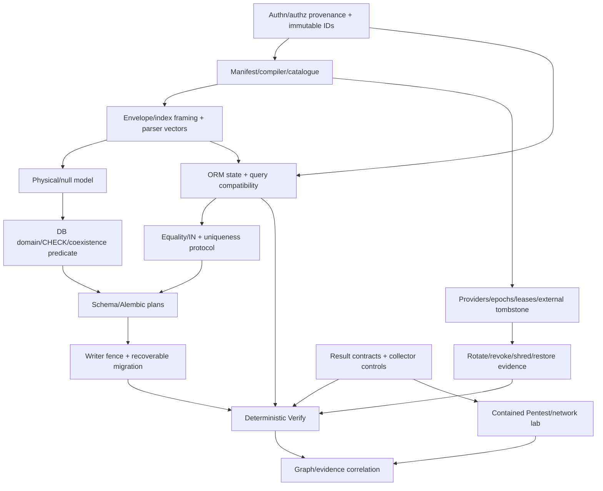

# Cryptalis: dependency-aware solo build guide

Status: construction guide. Bounded manifest JSON, content digests, identity-header validation,
parent-link validation, structural field-format digests, and offline terminal inspection exist.
Private candidate F1/W1 structural parsing also exists. Authentication and format freeze remain pending.
See the [checklist](backend-build-checklist.md) for current
evidence. Reviewed 2026-10-04.

Prerequisites:

1. Read the [product description](../README.md).
2. Read the [architecture owners](architecture/README.md).

This guide owns learning and construction order, with suggestions for the first files.
It does not define a second manifest, key lifecycle, capability table, or application programming interface (API).
The [checklist](backend-build-checklist.md) owns evidence state.

## Manual learning contract

In the default learning workflow, one human builder types source and tests, one explained file at a time.
A failing behavior test starts each new behavior slice. Existing tests can protect multiple implementation files.
The [playbook testing policy](../ENGINEERING_PLAYBOOK.md#test-layers) owns boundary selection and selective unit-test criteria.
Artificial intelligence (AI) can edit documentation directly. Explicit user instructions can
authorize direct implementation for a named scope under the [playbook](../ENGINEERING_PLAYBOOK.md#solo-manual-typing-workflow).
The assistant and builder can discuss small related files together. The assistant supplies them separately.

Each slice follows the [explicit failure policy](../ENGINEERING_PLAYBOOK.md#fail-loudly-and-explicitly).
Explain its failure channel, safe diagnostic context, recovery contract, and success postconditions before typing.

Prerequisite: The builder understands the previous result before the assistant supplies the next file.

For each assisted file, the assistant uses this cycle:

1. Explain responsibility, dependencies, inputs, outputs, the invariant, and likely failures.
2. Supply exactly one file in conversation for manual typing.
3. Give one command and its expected result.
4. Diagnose the builder's actual output.

Before typing, ask about unexplained details.
The assistant withholds the next file's contents until the builder understands the result.

Numbers below identify learning threads. They do not limit the research program.
Each thread can start with isolated fixtures, primary literature, or prototypes.
Integration requires actual evidence from dependencies.
A workstream number or convincing design document does not supply that evidence.

## Dependency spine

W-3 requires a literal order: freeze framing and version bytes and parser errors before designing meaningful database checks for malformed shapes.
A CHECK does not establish cryptographic authenticity.
Identity provenance precedes key selection and SQL.
The asynchronous comparison includes explicit warm with local crypto, actual adapted greenlet remote input/output (I/O), and deferred batches.
Backfill cannot precede a decision about writer coexistence and fencing.
Tombstone denial precedes destructive key work.

Detailed contracts own each state transition and acceptance budget.
The Protection Manifest defines policy. The derived Protection Graph contains evidence and unknowns, not policy authority.

## Workstream catalogue

The paths below suggest files in proposed packages. Check existing implementation before adding a file.
The [module owner](architecture/manifest-context-api.md#packages-and-dependency-direction) freezes responsibilities.
A documented decision can change filenames if it preserves those responsibilities.
For each behavior slice, choose the highest executable boundary and its observable failure before implementation.
Reuse or extend useful scenarios. Do not create a corresponding test file for every source file.
Record pending E2E workflows when dependencies are not executable.

Learn the model before copying a framework example. The linked owners define exact gate thresholds.

Object-relational mapping (ORM) connects Python state to database state.
The catalogue also uses intermediate representation (IR), abstract syntax tree (AST), and control-flow graph (CFG) for analysis structures.
Data transfer objects (DTOs) define shared result structures.
Authenticated encryption with associated data (AEAD), nonces, and additional authenticated data (AAD) govern payload protection.

| Thread / purpose | First files and construction sequence | Concepts / dependencies / learning exit |
|---|---|---|
| 0 Evidence baseline | Minimal packaging and runner/fixture setup for the first manifest or context behavior gate | Setup enables behavior checks. Import-only smoke tests are not a quality gate. C00/C26 require their own evidence |
| 1 Trusted context + manifest | contracts/ids, provenance grant DTO, manifest/model, naming, compiler, diff | Host identity versus authorization. Canonical bytes and versioned policy. C01/C02 vectors and substitution gate |
| 2 Envelope/local keys | crypto/kdf, aead adapter, envelope. Then keys/provider, local | AEAD, nonces, AAD, and domain separation. C03 vectors, parser, failure, and size checks before suite freeze |
| 3 ORM write/read | sqlalchemy/context, mapping, descriptor, events | Logical versus hidden physical history, rollback, loaders, and identity map. C04/P1 useful enumerated sync/async cells |
| 4 Async alternatives/query IR | Explicit warm and hidden-row batch experiment. Greenlet/deferred comparisons. Query IR, comparators, and guards | Actual yielding versus blocking, cancellation, cold unknown subjects, and operators that fail explicitly. C05/C06/P2/P3 |
| 5 Equality/uniqueness | crypto/normalization, search. Then comparator binds and the DB uniqueness protocol | Exact normalized and null semantics, leakage, and shared-domain costs. C08/C09/P5 authoritative domain safe against races |
| 6 Schema compiler | schema/physical, compiler, compare | Catalogues, domains, CHECK, indexes, and collisions. C10 plan-only output after frozen bytes |
| 7 Alembic/migration | alembic/operations, renderers, comparators. Then migration/state, plan, backfill, verify | Public extension APIs, additive coexistence, chunk compare-and-swap (CAS), checkpoints, writer fence, and nontransactional index recovery. C11/C12/P6 |
| 8 Provider/cache/lifecycle | keys/cache, provider adapters, lifecycle, tombstones | Explicit identity and access management (IAM) and provider differences, epochs, leases, concurrent idempotency, and outage. C13..C15/P7 |
| 9 Bounded shredding/controlled release | Shred request/state/receipt and independent release authority | Restored bytes versus managed access denial, suspended workers, backups, and search residue. C16/C17. No universal erasure |
| 10 Doctor/plan | doctor/workspace, Python AST, stable syntax/semantic IR, symbols, rule/finding models | Source spans, name resolution, query evidence, and unknowns. C18/C19/P9 corpus, not invented soundness |
| 11 Dataflow depth | doctor/cfg, def-use, summaries, call graph, typed taint, framework models | Fixed points, async exceptions, and transformations for each sink. Per-rule assurance gates |
| 12 Results/Verify/graph | Evidence DTOs, verify/invariants, collectors, exposure, scenarios. Then graph provenance and writer ledger | Controls, watermarks, mutants, unknowns, and contradictions. C20/C21/C24/P8 |
| 13 Pentest/network | Safety broker, pentest/target, external ZAP adapter, endpoints/auth/mutate/execute/replay. Then packet capture (PCAP) ingestion | Roles, state, containment, payload intent, transport layer security (TLS) limits, and baseline/protected/mutant replay. C22/C23 |
| 14 CLI/release integration | cli composition/config/errors. Then evidence validators/renderers | Safe visible actions and exit codes, import/wheel quarantine, and exact support cells. C25..C30 |
| 15 Advanced constructions/ecosystem | Isolated search and analyzer experiments. Additional framework/provider/tool adapters | Published oracles, leakage, usability, and maintenance. C31/C32. No ceiling on research breadth |

An early integration checkpoint combines one ORM path, randomized payload and equality, and one safe retrofit.
It also includes one lifecycle profile, Doctor lint, Verify controls, and authorized ZAP impact evidence.
It is an integration checkpoint, not the full scope or a production release.
Advanced search, static application security testing (SAST), dynamic application security testing (DAST), networking, and distributed experiments remain active before release integration.

## What each gate teaches

Manifest vectors teach deterministic policy and compatibility. ORM fixtures teach framework state.
Async experiments teach hidden coupling to availability and cancellation.
Leakage experiments show that query convenience changes the adversary's information.
Migration chaos teaches recovery instead of trust in autogeneration.
Lifecycle faults teach bounded distributed authority and backup recovery.

The Doctor corpus teaches precision with unknowns. Verify mutants teach detector self-testing.
Pentest containment teaches target authorization. Bundle review distinguishes integrity from truth.

Prerequisite: Targeted tests, applicable broader boundary checks, and real SQL, row, and artifact inspection are complete.

1. Explain the result in your own words.
2. Update its evidence row.
3. Advance to the next coding cycle.

Do not silently broaden a query, search capability, or profile to make a test pass.
Failed experiments and reclassified capabilities count as learning outcomes. Keep them in the record.

## Build and reference decisions

Use established crypto libraries and external root custody.
Independently implement attributed known search, program-analysis, and network techniques only in the research profile, against a credible oracle.
Integrate mature vulnerability and secret feeds and packet decoders.
Internal generic SAST and DAST can teach deeply.
Production differentiation still requires correlation with protected assets.

The [research philosophy](learning-first-research-philosophy.md) owns evaluation criteria and broader experiments.
[Prior art](prior-art.md) owns dated competitor comparisons, limitations, and evidence.

For runtime candidates, consult [ORM compatibility](architecture/orm-schema-migration.md).
A dependency version here does not imply support.
Format and primitive freeze requires vectors and review. Pending gates block the affected public claim.
The [blueprint](architecture/README.md#fatal-risks-and-resolution-gates) defines stop conditions.
These include automatic schema application, invented context, changed query semantics, unbounded cache authority, unsafe active testing, and sensitive bundles.

## Next-file assistance

Prerequisite: Name the thread and invariant.

The assistant's response includes the dependency and gate, exact future file path, purpose, and concepts to understand.
It supplies one complete file for manual typing, a walkthrough, command, expected outcome, and common discrepancies.
The assistant supplies no next code until the builder understands the actual output.
The [playbook](../ENGINEERING_PLAYBOOK.md) owns contribution and release processes. This guide owns learning order.
