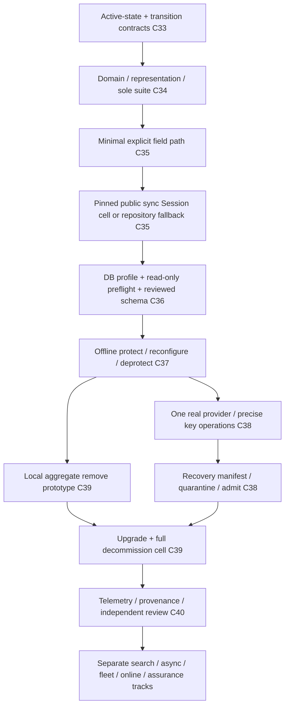

# Cryptalis: dependency-aware solo build guide

Status: construction guide. Bounded manifest JSON, content digests, identity-header validation,
parent-link validation, structural field-format digests, and offline terminal inspection exist.
Private candidate F1/W1 framing and scalar syntax encoding and decoding also exist.
Authentication and format freeze remain pending.
See the [checklist](backend-build-checklist.md) for current
evidence. Reviewed 2026-10-04. Build order reconciled 2026-10-05.

Prerequisites:

1. Read the [product description](../README.md).
2. Read the [architecture owners](architecture/README.md).

This guide owns learning and construction order, with suggestions for the first files.
It does not define a second manifest, key lifecycle, capability table, or application programming interface (API).
The [checklist](backend-build-checklist.md) owns evidence state.

## Manual learning contract

In the default learning workflow, one human builder types source and tests, one explained file at a time.
A failing behavior test starts each new behavior slice. Existing tests can protect multiple implementation files.
The [playbook testing policy](../ENGINEERING_PLAYBOOK.md#test-layers) owns boundary selection and selective unit-test criteria.
Artificial intelligence (AI) can edit documentation directly. Explicit user instructions can
authorize direct implementation for a named scope under the [playbook](../ENGINEERING_PLAYBOOK.md#solo-manual-typing-workflow).
The assistant and builder can discuss small related files together. The assistant supplies them separately.

Each slice follows the [explicit failure policy](../ENGINEERING_PLAYBOOK.md#fail-loudly-and-explicitly).
Explain its failure channel, safe diagnostic context, recovery contract, and success postconditions before typing.

Prerequisite: The builder understands the previous result before the assistant supplies the next file.

For each assisted file, the assistant uses this cycle:

1. Explain responsibility, dependencies, inputs, outputs, the invariant, and likely failures.
2. Supply exactly one file in conversation for manual typing.
3. Give one command and its expected result.
4. Diagnose the builder's actual output.

Before typing, ask about unexplained details.
The assistant withholds the next file's contents until the builder understands the result.

Numbers below identify learning threads. They do not limit the research program.
Each thread can start with isolated fixtures, primary literature, or prototypes.
Integration requires actual evidence from dependencies.
A workstream number or convincing design document does not supply that evidence.

## Dependency spine

The [checklist foundation rows](backend-build-checklist.md#ordered-foundation-slices) own dependencies and evidence.
The [unresolved register](architecture/README.md#unresolved-research-questions) owns Q1–Q10.
Q1–Q5 remain open. Research closure and [P0 documentation review](architecture/README.md#p0-documentation-review-register) precede dependent runtime implementation.
Current structural descriptor/framing helpers do not admit real ciphertext.
Freeze revised identity/binding bytes and an established suite before schema checks or ORM transparency.
Desired policy never supplies active authority. A derived graph supplies evidence only.
Offline quiescence replaces initial dual writers/journals/fleet leases. Complete verification still precedes activation.
Search, async, online, multi-provider, graph, and pentest remain later independent gates.

## Workstream catalogue

The paths below suggest files in proposed packages. Check existing implementation before adding a file.
The [module owner](architecture/manifest-context-api.md#packages-and-dependency-direction) freezes responsibilities.
A documented decision can change filenames if it preserves those responsibilities.
For each behavior slice, choose the highest executable boundary and its observable failure before implementation.
Reuse or extend useful scenarios. Do not create a corresponding test file for every source file.
Record pending E2E workflows when dependencies are not executable.

Learn the model before copying a framework example. The linked owners define exact gate thresholds.

Object-relational mapping (ORM) connects Python state to database state.
The catalogue also uses intermediate representation (IR), abstract syntax tree (AST), and control-flow graph (CFG) for analysis structures.
Data transfer objects (DTOs) define shared result structures.
Authenticated encryption with associated data (AEAD), nonces, and additional authenticated data (AAD) govern payload protection.

| Thread / purpose | Suggested future files and behavior sequence | Dependencies and learning exit |
|---|---|---|
| C33 Authority/contracts | contracts/active, transition, approval, receipt, errors; manifest history/current-head validators and development authority | Authenticated intent versus active state, CAS, ancestry, stale/wrong-target/redacted plan. No crypto or DB mutation |
| C34 Identity/suite | contracts/ids, successor descriptor/catalogue, reviewed AEAD/KDF/wrapping adapter and local provider | Generated representation/domain bindings, exact-key and nonce rules, external vectors and independent review before ciphertext |
| C35 Explicit field then ORM | Minimal repository/session codec path, then sqlalchemy/context, mapping, descriptor/events through public hooks | One no-search scalar workflow and trusted Session identity. Pinned sync load/history/rollback/refresh/bypass evidence or repository fallback |
| C36 Database/preflight | schema/snapshot, profile, preflight, physical compiler; alembic operations/renderers | Target identity, roles/ownership/search_path/RLS/executable code/2PC/CDC/index/logging/capacity. Reviewed DDL output only |
| C37 Offline transition | transition/plan, executor, checkpoint, transform, terminal verifier, finalizer | Writer exclusion, chunk/row revisions, crash/retry/overlap/CAS and exact irreversible approval. PROTECT/reconfigure then DEPROTECT |
| C38 Keys/recovery | One provider adapter and bounded single-process cache, key-operation effect plans, recovery manifest and restore admission | Native provider states, rewrap versus new writes versus re-encryption, quarantined restore/current denial/offline-recovery limits |
| C39 Exit/compatibility | Aggregate remove after local deprotect, then compatibility matrix/startup/upgrade checks and provider-dependent exit | Old binaries/jobs/DB objects/copies/recovery reader, package absence, one writer version, adjacent-version/retirement/restore evidence |
| C40 Release | Safe telemetry/configuration, canary sink fixtures, redacted diagnostics and product artifact verification | Dependency lock, SBOM, provenance/Trusted Publishing, source-to-wheel and import quarantine, independent review |
| Later search | Normalization/terms/comparators and database uniqueness, then offline REINDEX | Individual equality/IN/leakage/null/collision/coverage gates. No-search baseline first |
| Later async/fleet/online/CDC | Async alternatives, external provider budgets, mixed writers/journals/concurrent verification, replication profile | Exact independent cells. Never infer them from sync/offline evidence |
| Later assurance | Doctor IR/CFG/taint, graph/writer correlation, Verify breadth, Pentest/network/tool adapters | Per-rule oracles, containment, collector controls and comparative value. Not a first-transition prerequisite |
| Later ecosystem | Additional provider/framework/language/construction integrations | Published oracles, independent review, accepted leakage, usable cost, and maintenance commitment |

Suggested paths are prospective package responsibilities, not authorized scaffolding or existing artifacts.
Use the [module owner](architecture/manifest-context-api.md#packages-and-dependency-direction) and current tree before choosing an exact file.
The first useful integration checkpoint is one no-search path, exact DB preflight, and a resumable offline transition with scoped evidence.
It does not require equality search, Graph, ZAP, multi-process caches, or online coexistence.
Later research can proceed independently within its declared gates. It supplies no production claim.

## What each gate teaches

Manifest vectors teach deterministic policy and compatibility. ORM fixtures teach framework state.
Async experiments teach hidden coupling to availability and cancellation.
Leakage experiments show that query convenience changes the adversary's information.
Migration chaos teaches recovery instead of trust in autogeneration.
Lifecycle faults teach bounded distributed authority and backup recovery.

The Doctor corpus teaches precision with unknowns. Verify mutants teach detector self-testing.
Pentest containment teaches target authorization. Bundle review distinguishes integrity from truth.

Prerequisite: Targeted tests, applicable broader boundary checks, and real SQL, row, and artifact inspection are complete.

1. Explain the result in your own words.
2. Update its evidence row.
3. Advance to the next coding cycle.

Do not silently broaden a query, search capability, or profile to make a test pass.
Failed experiments and reclassified capabilities count as learning outcomes. Keep them in the record.

## Build and reference decisions

Use established crypto libraries and external root custody.
Independently implement attributed known search, program-analysis, and network techniques only in the research profile, against a credible oracle.
Integrate mature vulnerability and secret feeds and packet decoders.
Internal generic SAST and DAST can teach deeply.
Production differentiation still requires correlation with protected assets.

The [research philosophy](learning-first-research-philosophy.md) owns evaluation criteria and broader experiments.
[Prior art](prior-art.md) owns dated competitor comparisons, limitations, and evidence.

For runtime candidates, consult [ORM compatibility](architecture/orm-schema-migration.md).
A dependency version here does not imply support.
Format and primitive freeze requires vectors and review. Pending gates block the affected public claim.
The [blueprint](architecture/README.md#fatal-risks-and-resolution-gates) defines stop conditions.
These include automatic schema application, invented context, changed query semantics, unbounded cache authority, unsafe active testing, and sensitive bundles.

## Next-file assistance

Prerequisite: Name the thread and invariant.

Check C33–C40, current implementation, and the unresolved question dependencies before supplying runtime code.
If a required Q1–Q5 answer is open, supply its bounded research or contract-review task instead.
Do not create runtime behavior that depends on that answer.
After reviewed closure, use one behavior-first file slice and the existing manual workflow.

The assistant's response includes the dependency and gate, exact future file path, purpose, and concepts to understand.
It supplies one complete file for manual typing, a walkthrough, command, expected outcome, and common discrepancies.
The assistant supplies no next code until the builder understands the actual output.
The [playbook](../ENGINEERING_PLAYBOOK.md) owns contribution and release processes. This guide owns learning order.
