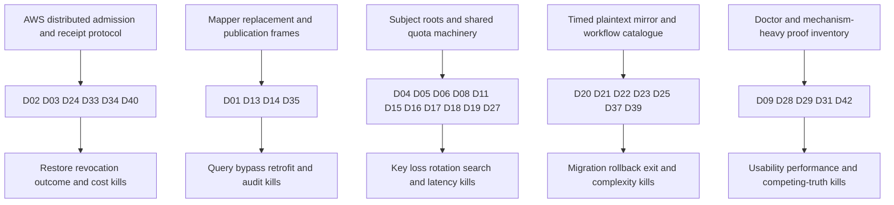

# Architecture revamp: evidence and disposition

Date: 2026-10-06 UTC. Status: substantial research/documentation progress; the full requested goal is **not complete**.
The small architecture is selected for the next deciding application test. It is not a tested shipping runtime.
The canonical path is README → architecture → security → lifecycle → compatibility → status → build guide.

## Selected architecture

Four responsibilities remain: compiler, native SQLAlchemy adapter, crypto/provider boundary, and transition executor.
The proposed public experience is one intent manifest, one session-factory attachment, and seven small CLI command families.
Optional full-term equality, exact finite range arrays and literal-prefix arrays use built-in PostgreSQL indexes.
Shared equality joins require an explicit common domain. Ordering retains a viable native-byte OPE research path rather than a blanket rejection.
Range arrays do not supply ordering. General LIKE/ngram candidate filters cannot masquerade as exact predicates.

Two independent random tenant-generation roots separate payload and search. A mature external KEK wraps them.
Normal warm operations derive locally from bounded process memory. They need no per-field KMS RPC or remote authority admission.
Current deployment policy/target/generation/wrapper identities remain outside database restores under existing deployment integrity.
Host authorization supplies current subject denial when that denial must survive restore.

One PostgreSQL journal and cooperating advisory lock track maintenance transitions.
The operator excludes writers. Chunk data and marker commit together. Full verification precedes database switch and external artifact publication.
Rollback transforms **current data** through the removal engine. No default timed live plaintext mirror remains.
Package removal is last, after the ordinary-schema application and retained backup recovery routes pass.

## Requested output map

| Requested item | Canonical answer / evidence | Completion boundary |
|---|---|---|
| 1. Simplified architecture | [Architecture](../architecture/README.md#components), four responsibilities | Selected research design |
| 2. Write/read/search paths | [Exact paths](../architecture/README.md#exact-data-paths) | Full PostgreSQL composition untested |
| 3. Hierarchy/providers | [Keys](../security.md#key-hierarchy-and-providers) | Local stand-in only |
| 4. Frame/search representations | [CF1](../security.md#cryptographic-format), [query encodings](../compatibility.md#query-semantics) | Exact proposal; independent vectors/composition review missing |
| 5. SQLAlchemy integration | [Integration](../architecture/README.md#sqlalchemy-integration) | Public-hook SQLite alternatives tested. PG/async/cascades unqualified |
| 6. Manifest | [Manifest](../architecture/README.md#manifest), [example](../../README.md#query-intent) | Proposed public schema, compiler not implemented |
| 7. Migration/rollback/deprotect | [Lifecycle](../lifecycle.md) | 100-row local transition evidence, full deployment untested |
| 8. Restore/revocation/destruction | [Restore](../lifecycle.md#restore-and-authority-loss), [destruction](../lifecycle.md#revocation-and-destruction) | Policy model only; retained-copy limits explicit |
| 9. Full query matrix | [Matrix](../compatibility.md#full-capability-matrix) | Every requested family classified |
| 10. Mechanism/leakage/cost/ORM/rotation per capability | Same matrix plus [physical evidence](../compatibility.md#database-evidence) | Unknown costs remain visible |
| 11. Leakage | [Security](../security.md#capability-leakage), measured attacks below | Synthetic fixture rates, no customer estimate |
| 12. CLI | [Public surface](../architecture/README.md#public-surface) | Designed, not implemented |
| 13. Deleted components | [Decisions](../decisions.md#deleted-mechanisms) and graph below | Architecture deletion, not new production source |
| 14. Fifteen kills | Table below | Narrow PASS/design evidence distinguished from blocked runtime |
| 15. Remaining decisions | Seven essential gates below; all old 33 mapped | No old mechanism-count proof target |
| 16. Existing-application retrofit | Section below | Incomplete; no full real-service app or edit counts |
| 17. Local spikes | Section below and [reproduction](../../spikes/revamp/README.md) | Real executable evidence with explicit boundaries |
| 18. Performance | [Database-only timings](../compatibility.md#database-evidence) | Whole backend, write costs and lifecycle scale unmeasured |
| 19. External/human requirements | Seven gates and [review](../decisions.md#independent-expert-review) | Remain required |
| 20. Documentation file changes | Table below | Preservation/link/word-count receipt accompanies applied docs |
| 21. Implementation order | [Build guide](../build-guide.md) | Next complete slice before full runtime |

## Local experiments

The existing research suite passed: **612 tests in 7.95 s**, exit 0, after canonical documentation replacement.
That is regression evidence for unchanged research source, not evidence of the new runtime.
No install, cloud call, commit, push, reset or revert occurred.

The existing isolated environment supplied Python 3.12.3, SQLAlchemy 2.1.3, psycopg 3.3.6,
cryptography 50.0.2 and bundled PostgreSQL 16.2. No new dependency was installed.
A normal local PostgreSQL startup failed to bind its Unix socket: `Operation not permitted`.
The executor was Linux in the correct workspace. No Windows wrapping, unchanged retry, or sandbox permission change was used.
A fresh owned cluster then ran through PostgreSQL's single-user backend without network sockets.

| Spike / artifact | Result | Actual boundary |
|---|---|---|
| [run_adapter.py](../../spikes/revamp/run_adapter.py), [adapter.json](../../spikes/revamp/results/adapter.json) | 28 positive/rejection cases pass, including same-ID cross-field transplant rejection. Raw-driver arbitrary-byte write is a negative control | SQLite, two logical text fields with an explicit shared equality domain, first prepared-string variant. Exact str identity changes. Reject that default |
| [run_native_types.py](../../spikes/revamp/run_native_types.py), [native-types.json](../../spikes/revamp/results/native-types.json) | 13 cases preserve exact str after flush/update/refresh/expiry/merge/autoflush/rollback. Duplicate values keep distinct row context. No plaintext wire bind observed | SQLite public before_flush/before_execute alternative. Explicit bigint IDs. Not complete clause/driver/async coverage |
| [run_stock_postgres.py](../../spikes/revamp/run_stock_postgres.py), [stock-postgres.json](../../spikes/revamp/results/stock-postgres.json) | One million rows; built-in B-tree/GIN indexes; exact selected IDs for equality/range/prefix. Restricted role checks and forbidden-language/role negative controls | PG16.2 single-user SET ROLE. No service authentication, concurrency, ORM/driver or full three-field payload path |
| [Packed expression result](../../spikes/revamp/results/packed-expression.json) | Million-row packed-expression equality index used; selected IDs match | CF1-shaped physical surrogate only, not authenticated CF1 |
| [token-checks.json](../../spikes/revamp/results/token-checks.json) | 1,056,768 finite range cases, 121 literal-prefix cases; explicit ngram false positive | Exact finite algorithms, not all PostgreSQL type/grammar semantics |
| [run_lifecycle.py](../../spikes/revamp/run_lifecycle.py), [lifecycle.json](../../spikes/revamp/results/lifecycle.json) | 100 rows; process interruption after durable chunk, retry keeps ciphertext, resume/full verify, tamper rejection, decrypt-back keeps later edit, generated storage removal | No concurrent writer/driver/lost transport/provider/application test. Package-free SQL only |
| Same lifecycle | Local root rewrap leaves payload unchanged; model denies retired generation | Local provider and policy substitutes, not live custody/authenticated restore |

The native-type alternative improves the integration hypothesis. It does not compose the separate experiments into a tested product.
The transition lab does not exercise CF1 companion reseal, search-key rotation, format upgrade, or full rollback to a different protected representation.
Those remain required tests. A source/target byte-count match alone is not full verification.

### Attack experiment

Technique: published frequency ranking from [Naveed et al., CCS 2015](https://www.microsoft.com/en-us/research/publication/inference-attacks-property-preserving-encrypted-databases/).
The attacker receives observed equality classes or complete visible token-array signatures and an independent auxiliary sample.
It ranks encrypted classes and plaintext auxiliary frequencies, then assigns corresponding labels.
The fixture uses 100,000 synthetic private rows and 100,000 independently sampled auxiliary rows per attack.
Names have skewed frequencies. Ages are clipped rounded Gaussian-like values from 18 through 95.
The public lab keys create representations. The ranking step receives only visible class counts and independent auxiliary frequencies.
Fixture generation and recovery scoring use the known synthetic values. The ranking step receives neither keys nor private labels.

| Representation | Row recovery | Class recovery | Unexecuted evidence |
|---|---:|---:|---|
| Equality HMAC | 100% | 100% | Real-customer distribution, chosen-query/insert variants |
| Complete prefix-term array | 100% | 100% | Prefix-specific structural attacks and customer distribution |
| Complete tree-range array | 27.211% | 33.333% | Published structural/volume attacks and customer distribution |
| Native-order OPE | UNKNOWN | UNKNOWN | No admitted implementation or sorting attack |

These rates demonstrate leakage under stated auxiliary knowledge. They do not certify safety or estimate every dataset's recovery.
`plan` must print applicable measured rates and assumptions per field. Missing acknowledgment or required attack evidence blocks apply.
Low-cardinality, sensitive classifications can be unsuitable for search even when the underlying primitive remains sound.

## Existing-application retrofit

**Not complete.** Neither lab is the requested representative service-mode PostgreSQL application.
The first adapter checks ordinary SQLAlchemy behavior but changes exact value type. The second avoids that defect in narrow SQLite cases.
Neither implements the proposed manifest compiler, complete range/prefix/order integration, async workflows, background inventory or package-free full application.

The new [ordinary application fixture](../../spikes/revamp/plain_app.py) has three native models and no Cryptalis attachment or protected types.
Its SQLite baseline passes 29 checks for CRUD, generated identities/defaults, tenant scope, uniqueness, NULLs, ranges,
ordering/pagination, literal prefixes, joins, relationships, decimal aggregates, ORM state, bulk/raw writes, and background sessions.
The fixture uses explicit ordering when results need a fixed order. Native relationship loading has no implicit order guarantee.
Its default service path checks the authorized endpoint before any mutation. Every connection pins the host, port, database, and role.
It checks that role before DDL and uses a separate owned scratch schema. Cleanup failure reports FAIL and the schema name.
The service baseline now passes 29 checks on PostgreSQL 16.15 and removes its owned schema.
This is baseline preparation, not a protected retrofit. Separate service suites cover selected native-type, async, COPY-control and concurrency cases.
The original application has no protected comparison, measured adoption edits or whole-backend performance result.
A frozen source hash accompanies each receipt.
See [SQLite receipt](../../spikes/revamp/results/plain-app-sqlite.json) and [service receipt](../../spikes/revamp/results/plain-app-service.json).

| Product benchmark | Result |
|---|---|
| Business-logic lines changed | Not measured on a representative application |
| Model changes | Not measured |
| Query changes | Not measured |
| Deployment changes | Not measured. External provider, current policy and writer-stop ownership are required |
| New developer concepts | Target: manifest, attach/session factory, capability leakage, plan/apply/status, provider/deployment ownership. Usability not measured |
| Required application remains functional | Unproved. Required unqualified queries must block retrofit before switch |

Do not turn a zero-edit example into a zero-edit benchmark. The next service test must retain the original application acceptance suite.
A viable OPE path must pass if ordering is required. Rejection is an honest admission boundary, not achievement of that application's product goal.

## Fifteen kill criteria

These classifications apply at the stated scope. They do not claim a passing shipping product.
Only the full gate can close a runtime criterion. A local PASS cannot hide its remaining blocker.

| # | Criterion | Result | Evidence and next deciding observation |
|---|---|---|---|
| 1 | Rotation commonly risks permanent loss | BLOCKED ON A SPECIFIC EXTERNAL TEST | Local rewrap preserves bytes. Live provider/backup recovery, interrupted payload/search reseal and old-reader tests remain |
| 2 | Migration corruption is easy | BLOCKED ON A SPECIFIC EXTERNAL TEST | 100-row full check rejects tamper. Real service interruption, missing/stale rows/companions and invalid index mutants remain |
| 3 | Rollback is mostly theoretical | BLOCKED ON A SPECIFIC EXTERNAL TEST | Current-data decrypt-back passes locally. Complete application protected/plain rollback and interruption remain |
| 4 | Uninstall strands data | BLOCKED ON A SPECIFIC EXTERNAL TEST | Native SQL read after removal passes. Full package-free application plus retained-backup readers remain |
| 5 | Search reveals sensitive values without warning | BLOCKED ON A SPECIFIC EXTERNAL TEST | Measured synthetic attacks and field-level acknowledgment contract exist. Actual plan refusal/output and realistic workload review unimplemented |
| 6 | Common/raw paths silently bypass | FAIL → REDESIGN | Raw-driver negative control bypasses. Complete guarded paths, role/shape controls and unknown-writer plan blocking must pass |
| 7 | Normal upgrades make old data unreadable | BLOCKED ON A SPECIFIC EXTERNAL TEST | Reader-first/dependency contract specified. Independent CF1 old/new reader and backup upgrade tests absent |
| 8 | Loss/recovery behavior is unclear | BLOCKED ON A SPECIFIC EXTERNAL TEST | Docs distinguish key loss from policy loss and copied roots. Live-provider restore/loss inventory test remains |
| 9 | Normal queries silently return wrong results | BLOCKED ON A SPECIFIC EXTERNAL TEST | Finite algorithm/SQLite cases pass, ngram exactness rejected. Full PG grammar/NULL/collation/constraints and native-type oracle remain |
| 10 | Security relies on source/config secrecy | BLOCKED ON A SPECIFIC EXTERNAL TEST | Public-source trust model specified, established primitives used. Frozen CF1 composition and independent review remain |
| 11 | KMS latency makes ordinary workloads unusable | BLOCKED ON A SPECIFIC EXTERNAL TEST | No per-field RPC in design. Whole-backend cold/warm/outage provider benchmark absent |
| 12 | Developers need crypto expertise | BLOCKED ON A SPECIFIC EXTERNAL TEST | Intent schema/selected profile hide primitive knobs. Real retrofit and ordinary-developer usability test absent |
| 13 | A giant control plane is required | PASS WITH EVIDENCE — architecture scope | Required graph now has four responsibilities plus existing deployment/provider. DynamoDB, S3 receipts, dispatcher and per-request authority removed from canonical contract |
| 14 | Nobody can audit the package | BLOCKED ON A SPECIFIC EXTERNAL TEST | Mechanism surface is smaller. Independent review of the implemented composition and package is still required |
| 15 | Docs contain competing truths | PASS WITH EVIDENCE — documentation scope | Single owner map and smaller reading path; old research explicitly historical. 134 current owner links and preservation/inventory checks pass. They do not prove full semantic correctness |

A failed writer boundary cannot be waved away by calling the host trusted. The host remains responsible for inventory,
but the library must enforce the boundaries it claims to admit.

## Old dependency graph

The old architecture generated dependencies that are no longer product requirements:

The graph explains causal groups, not independent proof obligations. Some essentials appear in more than one group.
The table below maps every one of the original 33 blocked IDs exactly once.

| Old ID | Disposition | Essential property now |
|---|---|---|
| D01 | Replace integration experiment | Native public parameter/projection adapter; G-ADAPTER |
| D02 | Retain one public declaration/lock, simplify authority | Deployment-integrity pin; G-POLICY |
| D03 | Delete DynamoDB/S3 authority mechanism | Current non-restored policy and host denial; G-POLICY |
| D04 | Retain candidate standard primitive | Composition/vectors/usage limits; G-CRYPTO |
| D05 | Simplify exact key selection | Policy-selected wrapper/generation, no trial-key authority; G-CRYPTO/G-PROVIDER |
| D06 | Reduce AAD to stable context | Relocation rejection and codec/header binding; G-CRYPTO |
| D08 | Broaden capability research, retain full terms | Exact useful queries plus disclosed leakage; G-QUERY |
| D09 | Delete doctor-specific policy subsystem | Embedded leakage acknowledgment, attacks and field suitability; G-QUERY |
| D11 | Preserve original semantics before adding normalizers | Qualified codec/collation equivalence; G-QUERY/G-CRYPTO |
| D13 | Retain essential bypass boundary without universal claim | Guarded paths and unknown-writer refusal; G-ADAPTER |
| D14 | Delete replacement buffered Result layer | Await material outside hooks, native async behavior; G-ADAPTER/G-PROVIDER |
| D15 | Delete AWS-only coupling | Separately qualified mature-provider custody; G-PROVIDER |
| D16 | Delete default subject-root topology | Two independent tenant roots and purpose separation; G-CRYPTO/G-PROVIDER |
| D17 | Delete authority-ledger disaster protocol | Tested policy/key/reader recovery inventory; G-POLICY/G-PROVIDER |
| D18 | Delete instantaneous operation-authority guarantee | Bounded cache plus operator termination and truthful copied-key limits; G-PROVIDER/G-POLICY |
| D19 | Delete distributed reservation service | Independent crypto usage-bound/fork proof still required; G-CRYPTO |
| D20 | Reuse one transition path | Separate rewrap/re-encrypt/reindex with authenticated metadata reseal; G-LIFECYCLE |
| D21 | Simplify journal/phases | Native chunk transactions and full terminal verification; G-LIFECYCLE |
| D22 | Retain maintenance writer pause | Real host exclusion and transaction drain; G-LIFECYCLE |
| D23 | Delete timed live plaintext mirror | Current-data transform-back and reader/key dependencies; G-LIFECYCLE |
| D24 | Delete RDS-only identity contract | One qualified deployment target/credential binding; G-POLICY |
| D25 | Retain non-hostage exit property | Full package-free app and backup route; G-LIFECYCLE |
| D27 | Keep provider/copy truth, no default subject destruction | Observed deletion plus remaining recovery inventory; G-PROVIDER |
| D28 | Delete standalone doctor subsystem | Reused essential startup/plan/apply/status checks |
| D29 | Retain mature release process, no package platform | Independent artifact/review evidence; G-RELEASE |
| D31 | Retain actual whole-backend measurement | Compare identical native app; G-RELEASE |
| D33 | Delete distributed fences/worker registry | Operator-owned writer stop and fresh worker restart; G-POLICY/G-LIFECYCLE |
| D34 | Delete ordinary per-flush receipt ledger | Ordinary transaction ambiguity is explicit. Markers only for idempotent transition chunks; G-LIFECYCLE |
| D35 | Delete remap/independent pending state/publication frame | Preserve native ORM state and per-value authenticated release; G-ADAPTER |
| D37 | Delete mirror generation capacity machinery | Plain temporary disk/WAL/provider/pause estimates; G-LIFECYCLE |
| D39 | Delete break-glass/dispatcher/reconcile command catalogue | Status plus same-operation resume/pre-switch abort; G-LIFECYCLE |
| D40 | Delete mandatory AWS three-resource footprint | Provider + existing deployment; actual adoption cost still measured; G-RELEASE |
| D42 | Replace subsystem-specific targets | Concrete application latency/adoption/maintenance budgets; G-RELEASE |

## Remaining essential decisions

Seven deciding proof gates remain: G-ADAPTER, G-CRYPTO, G-QUERY, G-LIFECYCLE, G-PROVIDER, G-POLICY and G-RELEASE.
[Build guide](../build-guide.md#seven-deciding-gates) defines observations that close each gate.
They correspond to useful application behavior and security/recoverability, not old internal mechanism preservation.
No gate is closed by a document, AI review, vendor feature, or count of local cases.

## Council synthesis

Ponytail was found and applied in full mode: reuse mature dependencies, remove internal machinery, and preserve required correctness.
The [native LLM Council skill](/home/debrato/Projects/oncosyn/.agents/skills/llm-council/SKILL.md) ran after the four-responsibility draft existed.
Four independent fresh read-only reviewers returned: claim auditor, product/UX, skeptical feasibility, and copy/narrative.
Biotech branding, oncology, and visualization roles had no material bearing on this backend architecture.
The shared [frozen brief](revamp-council-brief.txt) preserves the reviewed facts and unknowns.

**Decision: conditional acceptance as a research direction; hold adoption/shipping claims. Confidence: MEDIUM on reduction, LOW on runtime feasibility.**
No vote or average supplies that conclusion. The reviewers' material evidence gaps control it.

| Returned finding | Chair resolution | Residual proof |
|---|---|---|
| Claim auditor: changed authenticated search metadata requires reseal | Lifecycle now requires fresh nonce/payload reseal for capability/search-generation/commitment changes | Interrupted reindex/add/remove CF1 vectors remain |
| Claim auditor: recomputed HMAC does not detect collisions | Remove unconditional collision-failure promise. State computational exactness assumption and required human acceptance/validation decision | No collision detector or forced-collision admission proof |
| UX: exact type/retrofit contract unproved | Reject first subclass default. Add public parameter alternative with 13 native-type SQLite checks and minimum host contract | Full PG application, generated IDs/async/cascades remain |
| UX: acceptance suite must precede switch | Explicit every required workflow admitted/changed/blocked requirement | Representative retrofit remains incomplete |
| UX: pre-switch abort and separate policy switch need actionable status | Same-executor `apply --abort`, named pending artifact/operator, writers STOPPED across effects | Real interrupted authenticated deployment test remains |
| Feasibility: resource and maintenance costs incomplete | Plan requires length/term/depth/cover limits plus disk/WAL/provider/verification/pause estimates | Long/skewed/repeated-update and scale costs remain |
| Feasibility: moving work to deployment does not prove cheap adoption | Exact deployment profile/procedure and workload budgets required | Real operator/adoption benchmark remains |
| Copy: vetted/implemented wording overstates evidence | Replace vetted with selected research profile. Mark async/raw/restore behavior as proposed requirements/model-only | No independent security endorsement |

The native-type, same-ID substitution, frequency-array and offline CF1 tests followed the original brief.
They are chair evidence, not retroactive reviewer endorsements.
No external model/provider API was used. AI criticism is not an independent cryptographic audit.

## Documentation changes

| File | Change and reason |
|---|---|
| README.md | Small adoption story, one manifest example, precise stock prerequisites, no qualified provider claims |
| docs/architecture/README.md | Four responsibilities, exact paths, public-hook candidate, intent/lock/policy ownership and reduced CLI |
| docs/security.md | Two roots, proposed exact CF1/commitment, computational query assumptions, capability leakage, restore/erasure limits and typed failures |
| docs/lifecycle.md | One maintenance engine, current-data rollback, metadata reseal, pre-switch abort, deployment handoff and package-free exit |
| docs/compatibility.md | Full query-family matrix, exact stock DDL, million-row role/index evidence, timing/storage limits and UNKNOWN cells |
| docs/status.md | Separate old research, new isolated evidence and missing full application/runtime qualification |
| docs/build-guide.md | Seven essential proof gates and manual first complete application slice |
| docs/decisions.md | Selected smaller choices, deleted mechanisms, complexity budget and independent review |
| docs/prior-art.md | Current primary-source comparison replaces obsolete equality-only/AWS-control-plane choices. Starting contents preserved in the external baseline snapshot |
| docs/research/revamp-evidence.md | This requested-output map, kill results, all 33 historical dispositions, Council findings and unfinished work |
| docs/research/revamp-council-brief.txt | Actual shared Council brief; historical scope only |
| Older research Markdown files | Archive notices identify superseded scope. Historical evidence remains, with current owners linked |
| ENGINEERING_PLAYBOOK.md | Preserve user's manual/test/release policy. Only provider-specific release wording changes if needed |
| spikes/revamp/ | New isolated lab code, raw synthetic logs, result receipts and reproduction instructions. No production source changes |

The final integrity receipt records actual written files, links, word counts, lint and unchanged executable hashes.
It does not silently restore the user's deleted documents or discard their dirty AGENTS/playbook work.

## Completion audit and next work

The requested full real-service vertical slice, representative retrofit and whole-backend performance are incomplete.
Service access is now available under the user's scoped exception. Single-user PostgreSQL and SQLite remain useful historical evidence.
The new restricted-service suites also cover only their listed cases; they do not satisfy the complete vertical slice.
PostgreSQL 14/15/17/18, native-order implementation/attacks, complete advanced ORM rewrites and authenticated provider/policy tests also remain missing.
Cloud tests remain external UNKNOWN, as requested. No cloud credentials or deployment action is necessary for this research pass.

Continue with the unchanged service-mode application oracle and its required protected comparison.
Preserve the full request; do not redefine completion around these passing narrow experiments or the documentation reset.
The full requested goal remains incomplete.

## Verification receipt and authorized service limit

The current owner check passes: 134 local file/anchor links, all 33 old blocked-decision dispositions and all 15 kill-result rows.
It verifies 100 starting non-Markdown files unchanged, all 14 starting deletions preserved, and the exact narrow playbook wording change.
The seven-document reading path falls from 24,032 to 10,924 words. The first new-prose lint score is 2.04 findings per 100 words.
The second combined pass, including archival text, is 1.74. The final evidence-update prose scores 0.48.
The ordinary-application follow-up prose scores 1.11.
These checks do not prove runtime or semantic completeness.

The user then authorized a disposable PostgreSQL service and restricted migration role.
The connection URL never entered output, files or documentation. Its environment variable is absent from this executor.
A credential-free TCP probe fails at socket creation: errno 1, Operation not permitted. Authentication is not reached.
All service-dependent gates remain UNKNOWN. No test was weakened and no alternate database was used after that instruction.

A separate comparison before the service instruction exercised a live atomic plaintext mirror on 100 synthetic rows.
Normal dual writes preserved parity. A failed mirror write rolled back its ciphertext write.
An unmirrored writer broke parity, while decrypt-back recovered the latest ciphertext value.
The mirror occupied 3,203 logical column bytes alongside 9,203 payload bytes. These exclude SQL tuple/index/WAL costs.
This supports the selected current-data rollback direction, not production pause or concurrency claims.

See [documents.json](../../spikes/revamp/results/documents.json), [service-probe.json](../../spikes/revamp/results/service-probe.json), and [mirror-comparison.json](../../spikes/revamp/results/mirror-comparison.json).

## Offline frame follow-up

The offline CF1 fixture passes 30 behavioral and mutation checks.
It covers storage/equality/prefix framing, exact overhead, tenant/field/record binding, retired payload/search generations,
companion changes, capability removal, search reindex reseal, payload-only rotation and exact empty-text behavior.
Its byte-count vector is independent. The same library seals and opens the AEAD frames, so those roundtrips are not independent crypto vectors.
The fixture uses a narrow text descriptor and public synthetic roots. It does not qualify generic SQL codecs, usage bounds or ORM projections.

The proposed bigint record encoding is `T("int64", signed_eight_byte_big_endian_value)`.
A companion projection must carry actual returned arrays with the payload and row context.
For advanced fields, the candidate binary transport adds a four-byte payload length, then each declared array's four-byte count and length-prefixed terms.
The compiled lock fixes array order and capability identity. The reader rejects negative counts, excessive counts, invalid term lengths and trailing bytes.
Built-in `int4send`, `cardinality`, `unnest`, bytea `string_agg` and concatenation can construct that transport.
Each term has a signed four-byte length that must equal 32. A NULL term uses length -1 and must fail.
NULL payload remains SQL NULL. A missing companion count uses a negative sentinel, never a NULL projection that bypasses verification.
The service lifecycle follow-up exercises this transport through restricted PostgreSQL/psycopg reads and verification mutants.
It remains unqualified in the complete advanced-field SQLAlchemy adapter.

See [run_cf1.py](../../spikes/revamp/run_cf1.py) and [cf1.json](../../spikes/revamp/results/cf1.json).

## Service continuation checkpoint: 2026-10-07

The user requested continuation from the existing worktree, with the simplified-product requirements unchanged.
The executor ran Linux in `/home/debrato/Projects/cryptalis`. Existing work and deleted files remain preserved.

Command: `spikes/.venv/bin/python spikes/revamp/probe_service.py`. Observed exit: **3**.
The probe reports `url_environment_present: false` and TCP socket creation failure with errno 1, `Operation not permitted`.
Authentication was not reached. The probe created no database objects and printed no URL or credentials.
The [probe receipt](../../spikes/revamp/results/service-probe.json) records the observation.
The user reported that the variable was available. This executor observation shows that it was not visible to the probe process.
Both environment delivery and socket access need correction before service tests can run.
No sandbox permission change, Windows wrapper, alternate database, or unchanged retry occurred.

A source inventory also identifies missing test implementations. Connectivity alone will not complete these gates.

| Requested evidence | Current implementation and execution limit |
|---|---|
| Stock-role tests and million-row EXPLAIN/index tests | `run_stock_postgres.py` and `run_packed.py` use the historical single-user backend. Neither ran during this continuation. Service-mode equivalents remain required |
| SQLAlchemy retrofit | `plain_app.py` supplies a plaintext baseline. The protected adapters use SQLite. No complete protected PostgreSQL retrofit ran |
| Async, COPY, cancellation, concurrency | No complete revamp suite implements these acceptance cases. No such case ran |
| Lifecycle and fault injection | `run_lifecycle.py` covers historical single-user chunks and tamper. Service interruption, lost replies, writer exclusion, and full verification mutants remain untested |
| Whole-path benchmarks | No complete application/provider benchmark exists. No whole-path timing, throughput, storage, WAL, or pause result was measured |

Kill criterion 6 remains **FAIL → REDESIGN** from the existing raw-writer negative control.
No other kill criterion or blocked decision receives a new PASS or VERIFIED result.
All seven gates remain incomplete at their full scope. Earlier narrow evidence retains its original limits.
The connection failure does not disprove a subsystem. It supplies no basis for architecture redesign or weaker acceptance tests.

The next deciding run requires the authorized disposable service, its restricted role, and a visible protected environment configuration.
After connectivity succeeds, build the missing service suites around the unchanged application oracle and run them before closing decisions.

## Service-access repair: 2026-10-07

The user authorized a separate network-enabled workspace-write session as an exception to the repository sandbox rule.
Global Codex configuration did not change. The original executor remains unchanged.
The new sandbox denied an outside-workspace write with `EROFS` and reached the disposable PostgreSQL port.
The private launcher loads the URL from an owned `0600` file without printing it or placing it into command arguments.
It validates `127.0.0.1:55432/cryptalis_test` as `cryptalis_migrator` before execution.
After the user corrected an initially invalid private file, the connection probe succeeded.

| Execution | Observed evidence | Scope |
|---|---|---|
| Existing `probe_service.py` in the named workspace sandbox | Exit 0, `CONNECTED_RESTRICTED_ROLE`, PostgreSQL 16.15, variable present, authentication observed, no superuser/createdb/createrole powers, no objects created | Service connectivity and identity only |
| Existing `plain_app.py` against the disposable service | Exit 0, `PASS_PLAINTEXT_BASELINE_ONLY`, 29 checks, `OWN_SCHEMA_DROPPED`, source hash matches receipt | Plaintext SQLAlchemy baseline only |
| Fresh Codex CLI session with private environment injection | Its own shell ran the same probe and returned exit 0 with the variable present and authentication observed. Workspace-write sandboxing and network access were active | Executor delivery and shell-to-service access only |

The fresh CLI test session was `01a1152a-cbd5-7c53-896a-852205d01c91`.
The local launchers are outside the repository in `/home/debrato/cryptalis-executor-troubleshooting-20261007/`.
They preserve the existing worktree and use the already installed Codex and isolated Python interpreter.
Desktop database access was not qualified by these CLI tests.

The [probe receipt](../../spikes/revamp/results/service-probe.json) and
[plaintext service receipt](../../spikes/revamp/results/plain-app-service.json) contain the sanitized results.
No connection URL or credentials entered these receipts or documents.
Kill criterion 6 remains **FAIL → REDESIGN**. All seven full gates remain incomplete.
Async/COPY/concurrency, protected retrofit, service lifecycle faults, and whole-path performance receive no new PASS claim.

## Restricted-service experiments: 2026-10-07 continuation

The first requested probe passed again with `CONNECTED_RESTRICTED_ROLE`, PostgreSQL 16.15, exit 0 and no mutations.
The private configuration was used only for the authorized target. Its URL and credentials never entered commands, receipts or output.
The unchanged plaintext application then passed 29 checks again and dropped its owned schema.
No install, global permission change, Full Access, alternate database, commit, push, reset or revert occurred.

Three new isolated executable files ran sequentially. Each receipt freezes the executable and dependency hashes.
Each suite used the restricted migration role, created a uniquely named scratch schema and reported `OWN_SCHEMA_DROPPED`.

| Suite | Observation | Boundary |
|---|---|---|
| [Native service](../../spikes/revamp/run_native_service.py), [receipt](../../spikes/revamp/results/native-service.json) | Exit 0; 43 cases. Exact str, batched insert/update context, aliases/NULL outer projection, ORM state, failed-flush recovery, selected write rejection, ORM tamper/relocation, two async sessions, driver cancellation/recovery and concurrent term uniqueness | One text field/context; old public lab frame; explicit bigint IDs. Generated IDs reject. No original application, full clauses, cascades, tenant constraints or provider qualification |
| [Physical service](../../spikes/revamp/run_physical_service.py), [receipt](../../spikes/revamp/results/physical-service.json) | Exit 0; 9 checks, 1,000,000 rows, exact selective equality/range/prefix IDs and B-tree/GIN plans. Protected/control storage 854,171,648/155,394,048 bytes: 5.4968× | CF1-shaped packed surrogate and incomplete name/age field payloads. Database-only samples. No whole-backend/write-amplification/advanced-attack qualification |
| [Lifecycle service](../../spikes/revamp/run_lifecycle_service.py), [receipt](../../spikes/revamp/results/lifecycle-service.json) | Exit 0; 27 checks, 1,000 rows. Source-table writer lock, cooperating-lock denial, process exit after durable chunk, inspected resume, full verification mutants, actual companion transport, payload/search rotations, current-data decrypt-back and an isolated package-free read/write process | Public CF1 text roots. Post-commit process exit is not a lost transport reply. No deployment/provider/backup-reader qualification or original three-model application's complete removal |

The bind collector first detected an injected known plaintext marker. It then found no selected protected markers on the measured candidate writes.
The independent privileged COPY control stored arbitrary bytes despite attachment hooks.
That is expected negative-control evidence, not a safe writer path. Kill criterion 6 remains **FAIL → REDESIGN**.
The candidate refuses generated identities, so it cannot retrofit the original application unchanged.
Do not delete generated-ID, ordering, aggregate, raw/COPY or other required workflows from that oracle to claim success.

Lifecycle full verification rejects payload tamper, missing/extra rows, unexpected NULL, missing/NULL/short/duplicate companions,
wrong-record ciphertext, old-header/new-search-companion mixtures and a missing required index.
The proposed binary projection uses actual returned arrays and rejects trailing transport data and a negative payload length.
The phase remains BACKFILL after these mutants. Each mutation rolls back before the next case.
Current-data removal preserves a protected edit and subsequent rotations. The separate ordinary application then commits a further edit.
It excludes Cryptalis, cryptography and lab-reader imports. Its two-column mapping does not replace the required original application.

The service sample measured prefix p50/p95 at 8.543/9.408 ms versus 5.541/6.951 ms for the control.
This counters a general speedup claim. Equality and range were close in this sample.
Client generation plus both COPY loads took 29.17 s; index build plus ANALYZE took 14.03 s.
Actual index sizes and column datum bytes are recorded. Per-capability total costs, whole-backend tails, sustained writes and provider/maintenance budgets remain UNKNOWN.

The evidence supports three scoped decisions: keep testing native parameter preparation; retain stock B-tree/GIN candidates;
retain current-data decrypt-back rather than a live plaintext mirror.
It provides no reason to restore distributed authority, receipt services, custom Result publication or a new workflow platform.
All seven full gates remain **INCOMPLETE**. Live-provider custody, authenticated policy switch/restore, complete application admission,
retained backups, independent review and release artifacts remain required.

Continuation verification: `.venv/bin/python -m pytest -q` returned **612 passed in 15.59 s**, exit 0.
The owner checker passed 147 links, 33 historical decision dispositions, 15 kill rows, 100 unchanged original non-Markdown files and 14 preserved starting deletions.
The continuation snapshot separately verified all 61 starting paths and every new receipt's source/dependency hashes.
Existing executable files, AGENTS and the playbook remain unchanged from this continuation's start.
The snapshot is `/tmp/cryptalis-revamp-preserved-msjgqyah/`; it contains the starting patch and file copies.
These preservation/regression checks do not close a runtime gate.

## Integrated continuation and semantic audit: 2026-10-07

This checkpoint supersedes the earlier incomplete generated-identity/retrofit/lost-reply subsets, while preserving their receipts and scope limits.
The [current status](../status.md#current-integrated-checkpoint-2026-10-07) owns verdicts.
The [execution ledger](../../spikes/revamp/gate-plan.md) records the three violated invariants and smallest subsystem redesigns.
No public-package executable or original test was changed. No control plane, SQL parser, custom Result, plaintext query fallback or live rollback mirror was added.

The exact representative edit count is zero model edits, zero business-query edits, zero assertion edits, one typed replacement for the opaque SQL writer,
one manifest and one attachment call. Async additionally selects the guarded engine factory; it retains native AsyncSession.
The unchanged original source is hashed in every new fixture receipt. It is a representative synthetic existing application, not evidence from a deployed customer backend.

| Documented invariant | Executable observation or pending boundary |
|---|---|
| Declared protection before wire | Retrofit/boundary/async receipts: prepared CF1 binds; opaque SQL, driver/COPY and protocol handles denied before execution. Independent credentials/external writers remain unqualified |
| Fail before unsupported transformation | Context receipt: missing/unknown/unexcluded inventory, live type mismatch and multi-field scope reject before protected schema effects |
| Original generated identity/type | Original int32 BY DEFAULT sequence reservation, related parent/child assignment, bulk, savepoint/rollback and concurrent sequence tests pass. ALWAYS/custom/composite contracts reject or remain pending |
| Ordinary native state/value | Original 29 assertions plus exact str/history/refresh/merge/autoflush/relationships pass. Complete mappings and platform matrix remain pending |
| Stable record/tenant context | Original typed AAD, expected host point, explicit/computed PK rejection and direct/relationship tenant resealing pass. Host authorization remains outside crypto |
| Exact query semantics | Qualified equality/inequality/IN/NOT IN/NULL, aliases and scoped COUNT DISTINCT pass. Ordering/grouping/functions/casts on the protected field reject; full grammar and encrypted advanced fields remain pending |
| Useful searchable indexes | Actual one-million-row CF1 equality plan is selective and native workloads return identical values. Production/per-capability budgets and platform matrix remain pending |
| Bounded strict decoding | Context receipt covers malformed/truncated/trailing frames, generation/context/header/term mutations and original UTF-8/int32 boundaries. Frozen independent vectors, full codecs, usage bounds and human review remain pending |
| Exact local keys/cache | Independent roots, cold/warm/expiry/outage, no generation fallback and rewrap byte preservation pass. Provider custody, remote cancellation, deletion and fork invalidation remain pending |
| Chunk atomicity and inspected resume | Real SQL/injected key failures roll back marker and data; process interruption and resume preserve committed bytes. Fresh independent reader/key reconstruction remains pending |
| Lost COMMIT reply | Real receive EOF, absent marker before terminal state, later terminal transaction/matching marker and unchanged resume bytes pass. Failover/wrong-target classifications remain unqualified |
| Full terminal verification | Membership/value/type/NULL/generation checks, stale term/transplant/missing row/index mutants and same-transaction verification/switch pass. Other original dependencies/constraints need qualification |
| Writer exclusion and runtime ownership | Advisory contention and table-lock blocking pass only locally. Non-owning runtime role is absent; operator-wide exclusion and transaction drain remain UNKNOWN |
| Current-data rollback/deprotection | All three models/all original columns and types, including post-cutover edits, survive repeated transform-back and removal. Pre-switch abort UX and full conflict/remedy taxonomy remain pending |
| Package-free application | Fresh process denies crypto imports, verifies current data, commits an edit and passes all 29 original assertions. Durable retained-backup reader/key provenance remains pending |
| Separate transformations | Payload rotation, search rotation and local rewrap pass separately. Real provider/KEK migration and format/codec upgrades remain pending |
| Restore/current policy | Database phase explicitly remains policy-pending. Authenticated external publication/startup, stale workers and restored-old-policy denial have no designated host procedure; UNKNOWN |
| Removal/destruction honesty | Eligible local storage is removed. WAL/backups/dead tuples/copied keys are not claimed erased; native deletion, backup expiry and dependency disposition remain pending |
| Explicit failure/progress | Safe typed adapter codes, SQLSTATEs, original operation digest/markers, failing receipts and pending phase are observable. Product CLI/status/remedies and ambiguous remote effects remain unimplemented |
| Release/adoption/cost | Measured edits and paired native app costs are recorded. Approved budgets, independent review, locked production artifacts/provenance and all seven complete gate sets remain UNKNOWN |

Real implementation gaps found and fixed include DBAPI info exposing protocol handles, protected ORDER BY inspection,
stale compiled type/result processors, computed tenant or SQL-function assignments, caller-forged admission metadata,
relationship tenant changes, and Core assignment inspection after annotation-changing predicate traversal.
The guarded boundary now rejects unsupported shapes rather than sending plaintext or silently retaining ciphertext bound to an old context.

All final service checks passed at their stated scope. The actual-CF1 million-row receipt is reused after later admission-only fixes;
the current-cost run measures the changed adapter. Earlier 612 tests and completed documentation/inventory checks are retained.
No full gate is PASS. Provider/policy selection and independent human review are explicitly unavailable by the user's decision.
